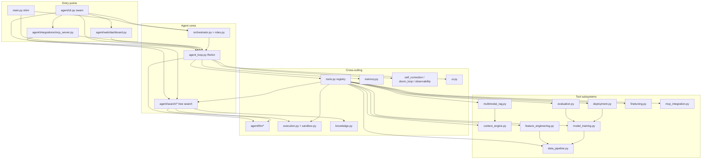

# 01 — Repository Structure

## Top level

```
agent2/
├── main.py                  # Thin shim → agent.cli:main (interactive REPL / headless)
├── pyproject.toml           # Package metadata; `swarn = agent.cli:main` entry point
├── requirements.txt         # Phase-annotated dependency list
├── .env / .env.example      # SWARN_* environment overrides (.env is gitignored)
├── .gitignore               # Ignores runtime artifacts: runs/, sessions/, workspace/, knowledge/, .chroma/
├── README.md                # V2/V3 feature guide (tree search, deployed endpoint)
├── README-phases-1-16.md    # Historical phase-by-phase codebase guide
├── docs/                    # Design documents (.docx/.pdf/.pptx/.doc), TOOLS.md + this LLD set
├── examples/                # Standalone capability demos (run without booting an agent)
├── scripts/                 # Developer utility scripts
├── artifacts/               # Capability output (annotated images, ingested docs) — SWARN_ARTIFACTS_DIR
├── agent/                   # THE package — the agent loop and everything it depends on
│   ├── __init__.py          # empty
│   ├── cli.py               # Typer CLI + the single REPL implementation (`swarn` command)
│   ├── config.py            # every SWARN_* env var, read in one place
│   ├── paths.py             # WORKSPACE_DIR/RUNS_DIR/… + workspace path guard
│   ├── task_router.py       # `swarn run` routing: document fast path vs. the ReAct agent
│   ├── data_bridge.py       # Materializes loaded datasets into the sandbox process
│   ├── data_cleaner.py      # Human-in-the-loop cleaning plan + approval + apply
│   ├── data_analysis.py     # Analyst tools: charts, rankings, significance, correlations
│   ├── data_report.py       # Evidence-checked findings report
│   ├── workbook.py          # Whole-workbook Excel inspection and loading
│   ├── core/                # ReAct loop, roles, orchestrator, correction/doom/approval/plan
│   ├── integrations/        # MCP client + MCP server
│   ├── llm/                 # deployed-endpoint router, clients, fine-tuning
│   ├── memory/              # session traces, cross-run knowledge, repo/multi-modal RAG
│   ├── messaging/           # prompt construction
│   ├── ml/                  # data → features → training → evaluation
│   ├── observability/       # guardrails, benchmarks, OTel hooks
│   ├── runtime/             # execution backends, tool registry, deployment packaging
│   ├── search/              # AIDE-style solution tree search
│   ├── utils/               # Rich terminal rendering — theme selector + classic/ and lain/
│   └── web/                 # FastAPI dashboard
├── swarn/                   # Self-contained capabilities the agent registers (one-way import)
│   └── capabilities/        # doc_intelligence, doc_qa, doc_csv, doc_store, doc_structure
├── tests/                   # test modules + zero-dependency runner
├── knowledge/               # RUNTIME: playbook.md + runs.db (KnowledgeStore) [gitignored]
├── runs/                    # RUNTIME: tree-search runs (journal.json, report.md, best_solution.py, workspace/) [gitignored]
├── sessions/                # RUNTIME: ReAct session traces (index.json, <uuid>/trace.json + summary.md) [gitignored]
├── workspace/               # RUNTIME: the agent's file sandbox (plots/, deployments/, finetune/…) [gitignored]
└── swarn.egg-info/          # Generated by `pip install -e .`
```

> Runtime directories (`runs/`, `sessions/`, `workspace/`, `knowledge/`, `.chroma/`) are
> created on demand by the code and gitignored; their presence in a checkout is leftover
> local state, not source.

## `agent/` — module-by-module

### Root entry surfaces & shared configuration

| File | Lines | Purpose |
|---|---|---|
| `core/agent_loop.py` | 620 | `AgentLoop` — the ReAct loop; context compaction; integrates correction/guardrail/doom-loop/observability policies. The one file that "deliberately evolves" as phases are added. |
| `cli.py` | 1,559 | Typer CLI **and** the single REPL implementation (`swarn` command). Sub-commands lazily import their subsystems; the REPL dispatches its document commands through the very same Click commands the shell invokes, so the two surfaces cannot disagree. |
| `web/dashboard.py` | 870 | FastAPI app: REST + websocket live feed + embedded single-file HTML dashboard. |
| `integrations/mcp_server.py` | 175 | FastMCP stdio server exposing `swarn_submit_task` / `swarn_task_status` / `swarn_get_messages` / `swarn_list_tasks`. |
| `utils/ui.py` | 190 | Rich-based rendering layer for search runs. The REPL/agent console output lives in `utils/terminal_display.py` and its themes (see below). |
| `messaging/prompts.py` | 322 | `SYSTEM_PROMPT` for the single agent (also sliced by `roles.py` for role prompts). |
| `config.py` | 229 | **Single place environment variables are read** — every `SWARN_*` knob with its default. Constants for import-time settings, functions for call-time ones. |
| `paths.py` | 42 | **Single source of truth for filesystem locations** — `WORKSPACE_DIR`, `RUNS_DIR`, `SESSIONS_DIR`, `KNOWLEDGE_DIR`, the `safe_path()` workspace guard and `safe_filename()`. All rooted at the repo, not at the importing module. |
| `__init__.py` | 0 | Empty — `agent` is a plain package. |

### LLM layer (`agent/llm/`)

| File | Purpose |
|---|---|
| `base.py` | Normalized types (`TextBlock`, `ToolUseBlock`, `LLMResponse`, `Usage`), `BaseLLMClient` with retry/backoff and usage accounting, `LLMError`. |
| `router.py` | **Single source of truth for the deployed endpoint** (`DEPLOYED_MODEL_NAME/BASE_URL/API_KEY`, env-overridable). `create_client(spec)` — returns the deployed `OpenAICompatClient` for everything except `mock:*`. Client cache. |
| `openai_client.py` | `OpenAICompatClient` — translates Anthropic-style messages/tools ⇄ OpenAI `/chat/completions`. |
| `mock_client.py` | `MockLLMClient` — scripted responses for offline tests; helpers `text_response()`/`tool_response()`. |
| `__init__.py` | Re-exports the public LLM API. |
| `llm_client.py` | Back-compat shim: Phase-1 `LLMClient` class delegating to `create_client()`. Used by `AgentLoop`. |

### Solution tree search (`agent/search/`)

| File | Purpose |
|---|---|
| `config.py` | `SearchConfig` dataclass — budgets, tree policy, parallelism, models, knowledge flags, static gate. |
| `journal.py` | `Node` + `Journal` — the solution tree; persistence (`journal.json`), queries (`draft_nodes`, `buggy_leaves`, `best_node`), prompt memory (`summarize`), ASCII rendering. |
| `agent.py` | `SearchAgent` — draft/debug/improve policy (`choose_action`), prompt builders, code extraction, LLM review with forced `submit_review` tool + regex metric fallback. |
| `runner.py` | `run_search()` — run-dir preparation, resume, sequential and thread-pool parallel scheduling, `_Budget` (time/token), knowledge integration, report + best-solution output. `SearchResult` dataclass. |
| `static_check.py` | Pre-execution AST gate: syntax errors, missing metric print, `input()` calls. |
| `data_preview.py` | Builds the "Data overview" prompt section: file tree + CSV dtypes/heads + JSON keys. |
| `report.py` | `write_report()` — `report.md` with tree, metric history, failure analysis. |
| `__init__.py` | Re-exports `SearchConfig`, `Journal`, `Node`, `SearchResult`, `run_search`. |

### Execution & tooling (`agent/runtime/`)

| File | Purpose |
|---|---|
| `runtime/execution.py` | `ExecResult`; `SubprocessBackend` (cross-platform, `sys.executable`, hard timeouts); `DockerBackend` (persistent container, bind-mounted workspace, timeout→container recycle); `make_backend()` auto-detect; process-wide `get_backend()`/`close_backend()`. |
| `runtime/sandbox.py` | Back-compat shim: `Sandbox` string-in/string-out facade over `execution.py`; `get_sandbox()`/`close_sandbox()`. Used by the `run_python`/`run_shell`/`install_package` tools. |

### Memory & knowledge (`agent/memory/`) · policies (`agent/core/`) · observability (`agent/observability/`)

| File | Purpose |
|---|---|
| `memory/memory.py` | `StepKind`, `Step`, `Session`, `SessionStore` — per-run structured traces persisted at close; `sessions/index.json`; live pub/sub hook (`subscribe_to_all_sessions`) used by the dashboard. |
| `memory/knowledge.py` | `KnowledgeStore` — bounded playbook (`playbook.md`, 6,000-char cap) + SQLite FTS5 run archive (`runs.db`); `context_for_task()`; `reflect_on_run()` post-run lesson extraction via forced `submit_lessons` tool. |
| `core/self_correction.py` | `SelfCorrectionPolicy` — error detection (`_is_error`), classification (`ErrorKind`), hint enrichment, consecutive-error abort budget. |
| `core/doom_loop.py` | `DoomLoopDetector` — result-hash-aware repetition detection (A,A,A and A,B,A,B shapes); corrective `WARNING` note. |
| `observability/observability.py` | `GuardrailPolicy` (prompt-injection regex scan of tool results + warning banner), `BenchmarkHarness` (canned guardrail test cases), `ObservabilityHooks` (OTel spans around LLM/tool calls), `_SpanContext`. |

### ML pipeline (`agent/ml/`) · retrieval (`agent/memory/`) · integrations (`agent/integrations/`)

| File | Purpose |
|---|---|
| `runtime/tools.py` | **THE tool registry** (1,817 lines). `@tool` decorator, `TOOL_REGISTRY`, `get_tool_definitions()` (with allow-list + MCP-visibility rule), `run_tool()` (never raises), the `_safe_path` workspace guard (re-exported from `paths.py`), and 55 tool wrappers spanning Phases 1–15, the document capabilities, and `solve_ml_task`. The remaining 20 tools are registered lazily by the analyst modules below. |
| `memory/context_engine.py` | `ContextEngine` — repo-RAG: AST-aware Python chunking + sliding-window text chunking, sentence-transformers embeddings, ChromaDB persistent collection (`.chroma/`, collection "codebase"), semantic `search()`. |
| `memory/multimodal_rag.py` | `MultiModalIndexer` — PDF text/tables (pdfplumber), image OCR/CLIP/caption, audio transcription (whisper); reuses the *same* ChromaDB collection and embedder as `ContextEngine`. |
| `ml/data_pipeline.py` | `DataPipeline` — in-memory dataset registry; CSV/Excel/Parquet/SQL/cloud loaders; validation report (dtypes, nulls, dupes, z-score outliers, optional pandera). |
| `ml/feature_engineering.py` | `FeatureEngine` — profiling with role inference; ColumnTransformer build (impute+scale, one-hot, frequency-encode, datetime decomposition); registers `<name>_features`. |
| `ml/model_training.py` | `ModelTrainer` — task-type detection; candidates (linear/logistic, RF, XGBoost, LightGBM, PyTorch MLP); leaderboard; artifact store with held-out test split; Optuna HPO. |
| `ml/evaluation.py` | `ModelEvaluator` — detailed metrics, confusion matrix / ROC / residual plots (PNGs in `workspace/plots/`), cross-model comparison. |
| `runtime/deployment.py` | `DeploymentPackager` — joblib/ONNX serialization, generated FastAPI `app.py` + `requirements.txt` + `Dockerfile` + `metadata.json` under `workspace/deployments/<id>/`. |
| `llm/finetuning.py` | `FineTuner` — dataset prep (JSONL, validation split), LoRA/QLoRA training via PEFT/Transformers, merge-and-export. |
| `integrations/mcp_integration.py` | `MCPManager` — MCP *client*: background asyncio event-loop thread, per-server owner task + request queue, dynamic registration of remote tools into `TOOL_REGISTRY` as `mcp_<server>_<tool>`. |

### Multi-agent (`agent/core/`)

| File | Purpose |
|---|---|
| `core/roles.py` | Role definitions: shared prompt core extraction from `SYSTEM_PROMPT`, per-role tool allow-lists, `ROLES` registry, `get_role_config()`. |
| `core/orchestrator.py` | `Orchestrator` — Planner→Coder→Reviewer→Tester pipeline with revision loop (`MAX_REVISION_CYCLES=3`), `BlackboardState`, verdict parsing (`APPROVED`/`NEEDS_CHANGES`/`PASS`/`FAIL`), markdown report. |
| `core/approval_policy.py` | 95 lines. Decides which tool calls need human sign-off before they run; `SWARN_AUTO_APPROVE` / `/yolo` bypass it. |
| `core/plan.py` | 42 lines. The in-memory task plan the REPL's `/plan` and the `plan_tool` output render from. |

### Analyst layer (`agent/data_*.py`, `agent/workbook.py`)

Registered **lazily** — each module owns a `_SWARN_TOOLS` dict and a `register_*()` function
that inserts its entries into `TOOL_REGISTRY`, skipping any name already present. The CLI
calls these during boot; code driving the registry directly must call them itself.

| File | Lines | Purpose |
|---|---|---|
| `data_cleaner.py` | 1,955 | The human-in-the-loop cleaning contract: `clean_dataset` diagnoses and returns a numbered plan changing nothing; `apply_cleaning` **blocks on human approval** and applies only approved ops into `<name>_clean`; `ask_human` is the generic approval prompt. Also `describe_dataset`, `group_dataset`. Thresholds from `SWARN_CLEAN_*`. |
| `data_analysis.py` | 2,707 | 12 analyst tools — `plot_column`, `plot_relationship`, `analyze_correlations`, `check_subgroups`, `compare_groups`, `rank_by`, `analyze_missing`, `analyze_multivalue`, `pivot_dataset`, `analyze_over_time`, `measure_duration`, `analyze_dataset`. Every chart is saved as a PNG under `workspace/plots/` **and** returned as a reading in words, because the agent cannot see the image. |
| `data_report.py` | 936 | `write_report` — the Background→Key figures→Key takeaways→Methodology→Appendix findings report. The narrative is the model's; the numbers, charts, cleaning record and limitations are generated from recorded evidence, and a narrative contradicting what was measured is **refused** with reasons. |
| `workbook.py` | 394 | `inspect_workbook` (every sheet's shape, columns, types, formulas and cross-sheet relationships, without loading data) and `load_workbook` (all sheets at once as `<file>_<sheet>` datasets). |
| `data_bridge.py` | 351 | Makes loaded datasets reachable from `run_python`. The registry lives in this process; the sandbox is a separate one. Before code runs, only the datasets the code *mentions by name* are materialized to the workspace and bound to plain variables by a generated bootstrap. |
| `task_router.py` | 195 | `swarn run` routing. A bare document question takes the fast path straight to `doc_qa` (one LLM call, verified output); anything needing more work goes to the ReAct agent, which still holds `swarn_doc_ask`. Deliberately conservative: it claims the fast path only when the task looks like a question *and* shows no sign of other work. |

### Capabilities (`swarn/`)

Self-contained units of work with their own schemas, artifacts and CLI surface. The import
direction is one-way and deliberate — `agent/runtime/tools.py` imports
`swarn.capabilities.*`, never the reverse at import time. A capability must run standalone
(`python examples/demo_doc_inspector.py` works without an agent loop, an LLM client, or a
vector store). Nothing is imported eagerly from `swarn/capabilities/__init__.py`.

| File | Lines | Purpose |
|---|---|---|
| `capabilities/doc_intelligence.py` | 2,337 | Visual Document Intelligence: PDF/image → structured fields **with** bounding-box coordinates → annotated PNG (colour-coded by confidence) + validated JSON. Backends: `vlm` (vision API), `text` (PDF text layer), `ocr` (tesseract), `mock`. Tool `swarn_doc_inspect`, CLI `swarn doc-inspect`. |
| `capabilities/doc_qa.py` | 1,051 | Grounded document Q&A: answer plus the evidence it rests on — each cited figure with page, verbatim quote and box, an annotated image, and the local computation when the answer required arithmetic the document does not state. Tool `swarn_doc_ask`, CLI `swarn ask`. |
| `capabilities/doc_store.py` | 783 | Parse-once storage: word-level text with boxes, per-word confidence, line ids, page dimensions and tables, persisted as JSON so repeat questions skip a full OCR pass. Tool `swarn_doc_ingest`, CLI `swarn ingest`. |
| `capabilities/doc_csv.py` | 533 | PDF tables → CSV, including **borderless** tables inferred from text alignment. Tool `swarn_pdf_to_csv`, CLI `swarn to-csv`. |
| `capabilities/doc_structure.py` | 183 | The document tree: nested sections, typed blocks (paragraph, list, key_values, table) in reading order, plus a flat label→value `fields` map. Tools `extract_pdf_document` / `extract_pdf_structured`, CLI `swarn extract-pdf`. |

### Terminal UI (`agent/utils/`)

| File | Lines | Purpose |
|---|---|---|
| `utils/terminal_display.py` | 39 | **Theme selector only.** Forwards every public name to the active theme, chosen by `SWARN_THEME` (`classic` default, or `lain`). Callers keep importing this one module. |
| `utils/classic/terminal_display.py` | 1,113 | The default green-on-black CRT theme: banners, tool-call rendering, plan display, `HeadlessDisplayManager` for one-shot/CI output. |
| `utils/classic/crt_boot.py`, `particle_logo.py`, `braille.py`, `boot_timing.py` | 129/242/121/15 | Boot animation and glyph rendering. Suppressed with `SWARN_NO_BOOT_ANIM=1`. |
| `utils/lain/terminal_display.py`, `theme.py`, `theme.yaml` | 629/62/— | The Lain theme, driven by an external YAML palette rather than hard-coded colours. |
| `utils/ui.py` | 190 | Rich rendering layer for search runs. |
| `utils/reliability_checks.py` | 29 | Startup environment sanity checks. |

## `tests/`

| File | Covers |
|---|---|
| `run_tests.py` | Zero-dependency runner: imports each module, runs every `test_*` function. |
| `test_llm_layer.py` | Deployed-endpoint routing, mock passthrough, block serialization, Anthropic↔OpenAI conversion, retry policy. |
| `test_execution.py` | Subprocess execution + timeouts. |
| `test_journal.py` | Tree ops + persistence. |
| `test_search_agent.py` | Policy transitions (incl. reservations), review parsing. |
| `test_static_check.py` | The static gate. |
| `test_knowledge.py` | Playbook cap/dedupe, FTS archive, reflection. |
| `test_doom_loop.py` | Repetition detection, context compaction. |
| `test_e2e_search.py` | Full offline sequential search with mock LLMs + real subprocess execution on synthetic data. |
| `test_parallel_resume.py` | Parallel journal validity, resume, static-gate skip-execution, token budget early stop. |

## Repository structure diagram


