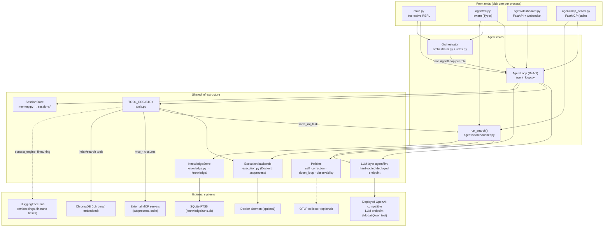

# 02 — System Architecture

## Architectural overview

Swarn is a **single-process, mostly-synchronous Python application** with four alternative
front ends over three agent cores, all sharing one LLM layer, one tool registry, and one set
of persistence stores.

## Layering

The codebase has a de-facto four-layer structure (not formally enforced, but consistently
followed):

1. **Presentation** — `main.py`, `cli.py`, `dashboard.py`, `mcp_server.py`, `ui.py`.
   Owns stdin/stdout/HTTP/stdio. Never contains agent logic beyond wiring.
2. **Orchestration** — `agent_loop.py`, `orchestrator.py` + `roles.py`,
   `search/runner.py` + `search/agent.py`. Owns control flow: when to call the LLM, when to
   run tools/scripts, when to stop.
3. **Capability** — `tools.py` and the subsystems it fronts (`data_pipeline.py`,
   `feature_engineering.py`, `model_training.py`, `evaluation.py`, `deployment.py`,
   `context_engine.py`, `multimodal_rag.py`, `finetuning.py`, `mcp_integration.py`,
   `execution.py`/`sandbox.py`). Owns *doing things*; each returns strings.
4. **Infrastructure** — `agent/llm/`, `memory.py`, `knowledge.py`, the three policies
   (`self_correction.py`, `doom_loop.py`, `observability.py`). Owns cross-cutting concerns.

## The two central invariants

### Invariant 1 — the tool registry is the extension point

`agent_loop.py` calls exactly two functions from `tools.py`:
`get_tool_definitions(names)` and `run_tool(name, input)`. Every capability from Phase 2
through 15, plus dynamically-registered MCP tools, plugs in through `TOOL_REGISTRY` without
any change to loop control flow (`tools.py` module docstring: *"agent_loop.py needs zero
changes"*). Tool definitions are re-fetched **every loop iteration** so tools registered
mid-run (via `connect_mcp_server`) become visible on the next LLM call
(`agent_loop.py:181`).

### Invariant 2 — one deployed LLM endpoint

`agent/llm/router.py` is the *only* place that decides where LLM traffic goes.
`create_client(spec)`:

- `spec == "mock"` / `"mock:*"` → `MockLLMClient` (tests/offline).
- anything else (including `None`, old BYO-LLM specs, `--model` flags) →
  `OpenAICompatClient(DEPLOYED_MODEL_NAME, DEPLOYED_BASE_URL, DEPLOYED_API_KEY)`, with a
  one-time console notice when a non-matching spec was requested.

Clients are cached per key in a module-level `_client_cache`. Consequences verified across
the codebase: `AgentLoop.model`, `SearchConfig.code_model/feedback_model`, CLI `--model`
flags, and dashboard `RunRequest.model` are all display/log-only (each site carries a comment
saying so).

## Component responsibilities and collaborations

| Component | Responsibility | Talks to |
|---|---|---|
| `AgentLoop` | Drive one ReAct task to completion; log a `Session`; apply policies in a fixed order (correction → guardrail → doom-loop) | `LLMClient`, `tools`, `SessionStore`, `ui`, policies |
| `Orchestrator` | Route work between roles; enforce revision cap; render report | `AgentLoop` (fresh per role invocation), `roles`, `ui` |
| `SearchAgent` | Decide next tree action; build prompts; extract code; review outcomes | `Journal`, LLM clients (code + feedback) |
| `run_search()` | Own the run lifecycle: dirs, resume, scheduling (seq/parallel), budgets, persistence, report, knowledge | `SearchAgent`, `Journal`, execution backend, `KnowledgeStore`, `report`, `data_preview`, `static_check` |
| `TOOL_REGISTRY` | Name → {description, schema, func} map; definition export; dispatch | every capability module (lazily imported inside tool bodies) |
| Execution backends | Run arbitrary Python/shell with timeouts; structured results | Docker daemon or local subprocess |
| `SessionStore` | Create/persist/index sessions; live step pub/sub | filesystem (`sessions/`), dashboard subscriber |
| `KnowledgeStore` | Bounded playbook + FTS5 run archive; context assembly; reflection | filesystem (`knowledge/`), SQLite, feedback LLM |
| `MCPManager` | Sync↔async bridge to external MCP servers; dynamic tool registration | background asyncio loop thread, MCP SDK, `TOOL_REGISTRY` |
| `ContextEngine` / `MultiModalIndexer` | Chunk/embed/upsert/search one shared ChromaDB collection | sentence-transformers, ChromaDB, pdfplumber/pytesseract/whisper |
| ML pipeline singletons | Registry-based tabular ML: load → validate → engineer → train → evaluate → package | pandas/sklearn/xgboost/lightgbm/torch/optuna/matplotlib/joblib |

## Process & deployment topology

- Everything runs in **one OS process** per entry point. There is no shared state between a
  `swarn serve` process and a `swarn run` process — explicitly documented in
  `dashboard.py`'s module docstring: the dashboard can only live-stream runs triggered via
  its own `POST /api/run`, because `get_session_store()` is a per-process singleton.
- The tree search may spawn a **thread pool** (`SearchConfig.parallel_workers`) inside the
  process; execution backends spawn subprocesses or a Docker container.
- `mcp_server.py` spawns a **daemon thread per submitted task**.
- `mcp_integration.py` runs **one daemon thread hosting an asyncio loop** plus one MCP
  server subprocess per connection.

## Notable architectural asymmetries (deliberate, documented in code)

- **Per-attempt vs. per-run policies:** each role invocation in the orchestrator gets a fresh
  `SelfCorrectionPolicy` (per-attempt error budget) but *shares* the `GuardrailPolicy` and
  `ObservabilityHooks` across the whole pipeline (aggregate findings) —
  `orchestrator.py.__init__` comment.
- **Session trace stores raw results; the model sees enriched results.** `agent_loop.py`
  logs `raw_result[:3000]` to the session but sends the correction/guardrail/doom-annotated
  string to the LLM ("the session trace stays clean and factual").
- **Search engine bypasses `tools.py`.** The tree search calls `make_backend(workspace)`
  directly (fresh backend per run, run-specific workspace), not the process-wide sandbox the
  ReAct tools use.
