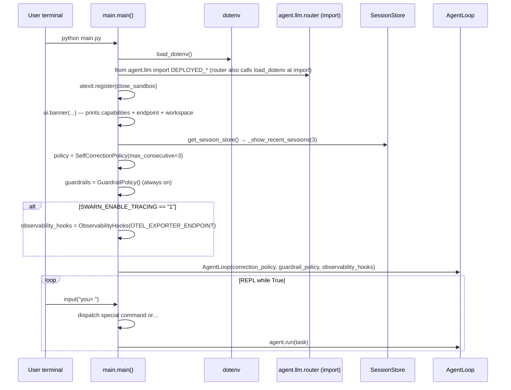

# 03 — Startup Sequence

There are four entry points. Each initializes only what it needs; heavy subsystems are
lazily imported inside functions (a consistent, commented convention: *"`swarn --help`
shouldn't need to construct an LLMClient just to print usage text"* — `cli.py:60`).

## 1. `python main.py` — interactive REPL

Files: `main.py`

Step-by-step (`main.py:71–216`):

1. `load_dotenv()` — reads `.env` into the environment.
2. `from agent.llm import DEPLOYED_BASE_URL, DEPLOYED_MODEL_NAME` — importing
   `agent/llm/router.py` itself calls `load_dotenv()` **again at module import time**
   (`router.py:39`) and resolves the three `DEPLOYED_*` values from env-or-default. No API
   key check is performed (comment: "No provider API key is required").
3. `atexit.register(close_sandbox)` — guarantees the Docker container (if one was started)
   is stopped on any exit.
4. `ui.banner(...)` prints capabilities, the resolved endpoint, and the workspace path.
   Note: `WORKSPACE_DIR` was already created as a **side effect of importing
   `agent.tools`** (`tools.py:74–77` runs `os.makedirs` at import).
5. `_show_recent_sessions(3)` — instantiates the `SessionStore` singleton (creates
   `sessions/`, loads `index.json`).
6. Constructs the long-lived policies and one `AgentLoop` (which constructs an `LLMClient`
   → `create_client()` → cached `OpenAICompatClient`; the OpenAI SDK client object is built
   here, but no network call happens until the first task).
7. REPL loop: special commands (`exit/quit`, `history [n]`, `recall <id>`, `guardrails`,
   `index <path>`, `clear`, `report`, `team <task>`) are handled inline with lazy imports;
   anything else goes to `agent.run(task)`. Between tasks
   `policy.consecutive_errors` is reset to 0 (total counters persist for the session).
8. `team <task>` constructs a **new `Orchestrator` per invocation**, passing the *same*
   guardrails/observability instances so findings aggregate across modes (`main.py:188–210`).

## 2. `swarn <command>` — Typer CLI

Files: `agent/cli.py`, entry point `swarn = "agent.cli:main"` in `pyproject.toml`.

At import time the CLI only imports `typer` and `agent.llm`'s `DEFAULT_MODEL` (which
transitively resolves the deployed endpoint config, including its `load_dotenv()`).
Each sub-command then lazily imports and wires its subsystem:

| Command | Wiring |
|---|---|
| `run` | `AgentLoop(model, SelfCorrectionPolicy(), GuardrailPolicy())` → `run(task)` → `ui.outcome(...)` → exit 0 iff `outcome == "complete"` |
| `team` | `Orchestrator(model, include_tester=not --no-tester, GuardrailPolicy())` → `run(task)` → print report markdown → exit 0 iff `final_outcome == "complete"` |
| `solve` | Validates `--data` dir (unless `--resume`); builds `SearchConfig` from flags (`steps`, `time_limit`, `drafts`, `exec_timeout`, `workers`, `token_budget`, `use_knowledge`/`reflect` = not `--no-learn`, models); `run_search(task, data, config, resume_run_id)`; exit 0 iff a best node exists |
| `sessions` / `recall` | `get_session_store().list_sessions(n)` / `.recall_as_text(id)` |
| `index` | `agent.tools.index_project(path)` |
| `playbook` | `KnowledgeStore().playbook()`; `--clear` deletes `playbook.md` |
| `guardrail-benchmark` | `get_benchmark_harness().run()` |
| `serve` | `uvicorn.run("agent.dashboard:app", host, port)` — the dashboard module is imported by uvicorn, not here |
| `mcp-serve` | `agent.mcp_server.main()` → `mcp.run()` (stdio) |

Notably, **no observability hooks are wired in the CLI** — `SWARN_ENABLE_TRACING` is only
honored by `main.py`'s REPL. `GuardrailPolicy` *is* wired in `run`/`team`.

## 3. `swarn serve` — dashboard startup

Files: `agent/dashboard.py`

1. uvicorn imports `agent.dashboard`, which imports `agent.llm` (endpoint config) and
   `agent.memory`, and constructs the module-level `app = FastAPI(...)` and
   `manager = ConnectionManager()`.
2. FastAPI `startup` event (`dashboard.py:176–180`):
   - `manager.bind_to_running_loop(asyncio.get_running_loop())` — stores the loop and
     creates the `asyncio.Queue`;
   - `get_session_store().subscribe_to_all_sessions(manager.on_step)` — registers the
     dashboard as a store-level subscriber for **all future sessions in this process**;
   - `asyncio.create_task(manager.broadcast_loop())` — starts the queue-draining broadcast
     task.
3. Requests then hit the REST/WS endpoints (see [13_APIs.md](13_APIs.md)). `POST /api/run`
   builds an `AgentLoop` and runs it in the default thread-pool executor so the event loop
   stays responsive.

## 4. `swarn mcp-serve` — MCP server startup

Files: `agent/mcp_server.py`

1. Module import constructs `mcp = FastMCP("swarn")` and registers the four
   `@mcp.tool()` functions.
2. `main()` → `mcp.run()` — blocks serving MCP over stdio.
3. `swarn_submit_task` spawns a daemon `threading.Thread(_run_task, ...)` per task; state
   lives in the module-global `_TASKS` dict guarded by `_LOCK` (lock is held only for
   insertion).

## Import-time side effects (worth knowing)

| Module | Side effect at import |
|---|---|
| `agent/tools.py` | `os.makedirs(WORKSPACE_DIR, exist_ok=True)` |
| `agent/llm/router.py` | `load_dotenv()`; resolves `DEPLOYED_*` from env |
| `agent/roles.py` | Slices `SYSTEM_PROMPT` via `str.index()` — raises `ValueError` at import if the `━━━` section markers are renamed in `prompts.py` |
| `agent/agent_loop.py` | Reads `SWARN_MAX_ITERATIONS` and `SWARN_CONTEXT_CHAR_BUDGET` into module constants (env changes after import have no effect) |
| `agent/execution.py` | Reads `SWARN_EXEC_TIMEOUT`, `SWARN_SANDBOX_IMAGE` into module constants |
| `agent/memory.py` | Defines `SESSIONS_DIR` (creation deferred to `SessionStore.__init__`) |

## Shutdown

- **REPL:** `exit`/`quit`/EOF/KeyboardInterrupt breaks the loop; `atexit` runs
  `close_sandbox()` → `Sandbox.close()` → `close_backend()` → `DockerBackend.close()`
  (stops container with 5s timeout). Sessions are already persisted (each `run()` closes its
  session).
- **CLI one-shots:** `typer.Exit(code)`; the same `atexit` hook is *not* registered (only
  `main.py` registers it), but `run_search()` closes its own backend in a `finally`
  (`runner.py:267–268`). A `swarn run` that started the process-wide Docker sandbox relies on
  the container's `auto_remove` + process exit. Unable to determine from the current
  implementation whether the persistent container is explicitly stopped in that path — it is
  not (no atexit in `cli.py`); Docker's `auto_remove=True` cleans up once the container is
  killed/stopped externally, and the container keeps running `tail -f /dev/null` otherwise.
- **Dashboard/MCP server:** killed by signal; no explicit shutdown hooks
  (`MCPManager.shutdown()` exists but no entry point calls it — verified by grep).
