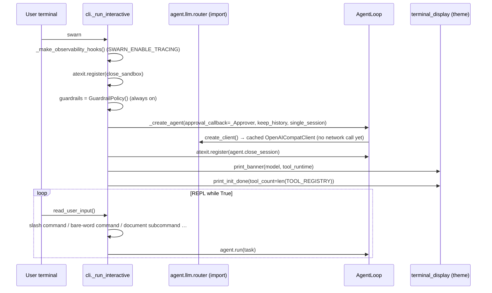

# 03 — Startup Sequence

There are four entry points. Each initializes only what it needs; heavy subsystems are
lazily imported inside functions (a consistent, commented convention: *"`swarn --help`
shouldn't need to construct an LLMClient just to print usage text"* — `cli.py:60`).

## 1. `swarn` (no subcommand) — interactive REPL

Files: `agent/cli.py` (`_run_interactive`). `main.py` is a 30-line shim that forwards argv
to `agent.cli:main` and nothing else.

> **Historical note.** `main.py` used to contain a second, hand-rolled REPL — a `while True`
> around `input("you> ")` with its own command table and its own banner. It drifted from the
> package REPL (commands existed in one and not the other; a fix to either left the other
> stale) and was collapsed into the shim. The package is also the only version that works
> from an *installed* copy, since a root-level module is not part of the `agent` package.

Step-by-step:

1. `_make_observability_hooks()` — returns `ObservabilityHooks(OTEL_EXPORTER_ENDPOINT)` when
   `SWARN_ENABLE_TRACING` is set (`config.py:120`), else `None`.
2. `atexit.register(close_sandbox)` — guarantees the Docker container, if one was started,
   is stopped on any exit.
3. `GuardrailPolicy()` is constructed unconditionally.
4. **The `AgentLoop` is built *before* the banner, deliberately.** Constructing it resolves
   the LLM client, which may print a routing notice; `print_init_done()` overwrites the
   banner's `Tools: loading…` line by walking the cursor back a fixed number of rows, so
   nothing may print in between. It is created with `keep_history=True` and
   `single_session=True` — one sitting at the prompt is **one** session, so `history` lists
   one entry per conversation rather than one per question — plus an `_Approver` callback
   for tool approval.
5. `atexit.register(agent.close_session)` — even an unhandled crash or a closed terminal
   leaves a finalized session behind rather than one that looks still-running.
   Turn-by-turn checkpointing already protects the content; this protects the closing state.
6. `print_banner` / `print_init_done` render through `agent/utils/terminal_display.py`, which
   forwards to whichever theme `SWARN_THEME` selects. `WORKSPACE_DIR` was already created as
   a side effect of importing `agent.runtime.tools` (`os.makedirs` at import).
7. REPL loop. Input is `lstrip`ed of a BOM first — piping a UTF-8-with-BOM script into stdin
   otherwise turns the first `/help` into a task for the agent. Then: slash commands
   (`/help`, `/plan`, `/new`, `/compact`, `/undo`, `/model`, `/effort`, `/status`,
   `/resume`, `/share-traces`, `/yolo`), bare-word commands (`history`, `recall`, `index`,
   `report`, `team`, `guardrails`), the document subcommands (`ask`, `ingest`, `inspect`,
   `to-csv`, `extract-pdf` — dispatched through the *same* Click command the shell invokes,
   see [13_APIs.md](13_APIs.md)), and anything else goes to `agent.run(task)`.
8. `EOFError`/`KeyboardInterrupt` closes the session and breaks the loop.

## 2. `swarn <command>` — Typer CLI

Files: `agent/cli.py`, entry point `swarn = "agent.cli:main"` in `pyproject.toml`.

At import time the CLI only imports `typer` and `agent.llm`'s `DEFAULT_MODEL` (which
transitively resolves the deployed endpoint config, including its `load_dotenv()`).
Each sub-command then lazily imports and wires its subsystem:

| Command | Wiring |
|---|---|
| `run` | `AgentLoop(model, SelfCorrectionPolicy(), GuardrailPolicy())` → `run(task)` → `ui.outcome(...)` → exit 0 iff `outcome == "complete"` |
| `team` | `Orchestrator(model, include_tester=not --no-tester, GuardrailPolicy())` → `run(task)` → print report markdown → exit 0 iff `final_outcome == "complete"` |
| `solve` | Validates `--data` dir (unless `--resume`); builds `SearchConfig` from flags (`steps`, `time_limit`, `drafts`, `exec_timeout`, `workers`, `token_budget`, `use_knowledge`/`reflect` = not `--no-learn`, models); `run_search(task, data, config, resume_run_id)`; exit 0 iff a best node exists |
| `sessions` / `recall` | `get_session_store().list_sessions(n)` / `.recall_as_text(id)` |
| `index` | `agent.runtime.tools.index_project(path)` |
| `extract-pdf` / `to-csv` / `doc-inspect` / `ingest` / `ask` | Lazily import the matching `swarn.capabilities.*` module and call it directly — **no agent loop, no LLM client, no vector store**. These are also the commands the REPL re-dispatches into. |
| `config` | `load_config()` → print the resolved configuration; `--path` prints the file location and exits |
| `playbook` | `KnowledgeStore().playbook()`; `--clear` deletes `playbook.md` |
| `guardrail-benchmark` | `get_benchmark_harness().run()` |
| `serve` | `uvicorn.run("agent.web.dashboard:app", host, port)` — the dashboard module is imported by uvicorn, not here |
| `mcp-serve` | `agent.integrations.mcp_server.main()` → `mcp.run()` (stdio) |

Both the REPL (`_run_interactive`) and headless mode (`_run_headless`) call
`_make_observability_hooks()`, so `SWARN_ENABLE_TRACING` is honored in either. Tracing stays
opt-in because span export adds console noise most runs don't want, and most environments
have no collector to send spans to. `GuardrailPolicy` is always on.

Headless mode passes **no approval callback**, so every tool call runs unprompted — it
exists to be scriptable, and a prompt written to a stdin nobody is watching would hang.

## 3. `swarn serve` — dashboard startup

Files: `agent/web/dashboard.py`

1. uvicorn imports `agent.web.dashboard`, which imports `agent.llm` (endpoint config) and
   `agent.memory.memory`, and constructs the module-level `app = FastAPI(...)` and
   `manager = ConnectionManager()`.
2. FastAPI `startup` event (`dashboard.py:176–180`):
   - `manager.bind_to_running_loop(asyncio.get_running_loop())` — stores the loop and
     creates the `asyncio.Queue`;
   - `get_session_store().subscribe_to_all_sessions(manager.on_step)` — registers the
     dashboard as a store-level subscriber for **all future sessions in this process**;
   - `asyncio.create_task(manager.broadcast_loop())` — starts the queue-draining broadcast
     task.
3. Requests then hit the REST/WS endpoints (see [13_APIs.md](13_APIs.md)). `POST /api/run`
   builds an `AgentLoop` and runs it in the default thread-pool executor so the event loop
   stays responsive.

## 4. `swarn mcp-serve` — MCP server startup

Files: `agent/integrations/mcp_server.py`

1. Module import constructs `mcp = FastMCP("swarn")` and registers the four
   `@mcp.tool()` functions.
2. `main()` → `mcp.run()` — blocks serving MCP over stdio.
3. `swarn_submit_task` spawns a daemon `threading.Thread(_run_task, ...)` per task; state
   lives in the module-global `_TASKS` dict guarded by `_LOCK` (lock is held only for
   insertion).

## Import-time side effects (worth knowing)

| Module | Side effect at import |
|---|---|
| `agent/runtime/tools.py` | `os.makedirs(WORKSPACE_DIR, exist_ok=True)` |
| `agent/llm/router.py` | `load_dotenv()`; resolves `DEPLOYED_*` from env |
| `agent/core/roles.py` | Slices `SYSTEM_PROMPT` via `str.index()` — raises `ValueError` at import if the `━━━` section markers are renamed in `prompts.py` |
| `agent/core/agent_loop.py` | Reads `SWARN_MAX_ITERATIONS` and `SWARN_CONTEXT_CHAR_BUDGET` into module constants (env changes after import have no effect) |
| `agent/runtime/execution.py` | Reads `SWARN_EXEC_TIMEOUT`, `SWARN_SANDBOX_IMAGE` into module constants |
| `agent/memory/memory.py` | Defines `SESSIONS_DIR` (creation deferred to `SessionStore.__init__`) |

## Shutdown

- **REPL:** `exit`/`quit`/EOF/KeyboardInterrupt breaks the loop; `atexit` runs
  `close_sandbox()` → `Sandbox.close()` → `close_backend()` → `DockerBackend.close()`
  (stops container with 5s timeout). Sessions are already persisted (each `run()` closes its
  session).
- **CLI one-shots:** `typer.Exit(code)`; the same `atexit` hook is *not* registered (only
  the REPL path registers it), but `run_search()` closes its own backend in a `finally`
  (`runner.py:267–268`). A `swarn run` that started the process-wide Docker sandbox relies on
  the container's `auto_remove` + process exit. Unable to determine from the current
  implementation whether the persistent container is explicitly stopped in that path — it is
  not (no atexit in `cli.py`); Docker's `auto_remove=True` cleans up once the container is
  killed/stopped externally, and the container keeps running `tail -f /dev/null` otherwise.
- **Dashboard/MCP server:** killed by signal; no explicit shutdown hooks
  (`MCPManager.shutdown()` exists but no entry point calls it — verified by grep).
