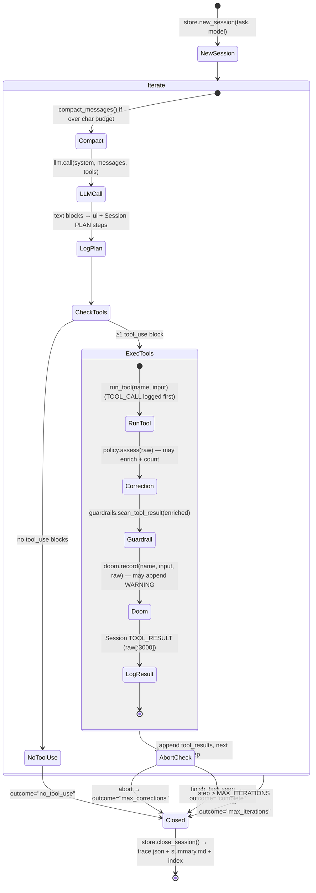
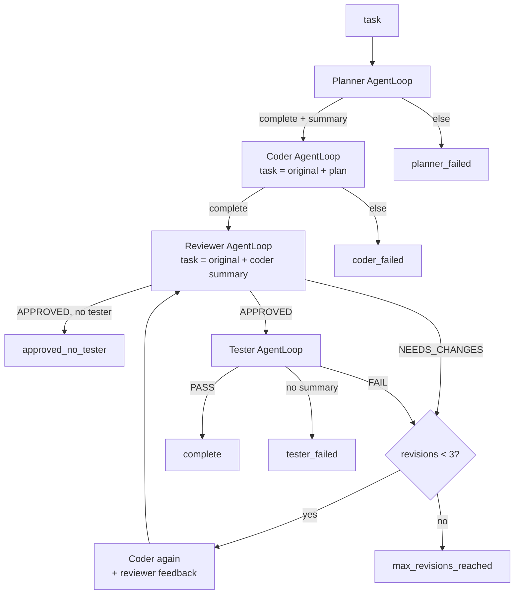

# 04 — Agent Lifecycle

Swarn has three agent lifecycles. All are synchronous, blocking, run-to-completion.

---

## A. The ReAct loop — `AgentLoop.run()` (`agent/core/agent_loop.py`)

### Construction

```python
AgentLoop(
    model=DEFAULT_MODEL,          # display-only; routing is fixed (router.py)
    correction_policy=None,       # SelfCorrectionPolicy | None
    system_prompt=None,           # defaults to prompts.SYSTEM_PROMPT
    tool_names=None,              # allow-list; None = all registered tools
    role_name=None,               # cosmetic prefix for UI lines
    guardrail_policy=None,        # GuardrailPolicy | None
    observability_hooks=None,     # ObservabilityHooks | None
)
```

Construction creates the `LLMClient` (cached deployed client) and grabs the `SessionStore`
singleton. `tool_names` is stored, **not resolved** — definitions are re-fetched each
iteration so MCP tools registered mid-run appear on the next LLM call (`agent_loop.py:142–148`).

### Run lifecycle (per task)



Key mechanics, in execution order per tool call (`agent_loop.py:218–312`):

1. **TOOL_CALL logged before execution** — "so we have a record even if execution hangs".
2. **Execution**, optionally wrapped in an OTel `tool_call_span`; a result starting with
   `"Error"` marks the span failed.
3. **Phase 4 correction** runs on the *raw* result (ordering matters: `_is_error()` relies on
   `startswith("Error")`, which a guardrail banner would break — comment at
   `agent_loop.py:240–246`). On error: `session.corrections += 1`, a CORRECTION step is
   logged, a hint block is appended to the result, and `should_abort()` is checked.
4. **Phase 15 guardrail scan** runs on the (possibly enriched) result and may prepend the
   injection-warning banner.
5. **Doom-loop detection** hashes `(tool, canonicalized args, raw_result[:2000])`; on
   trigger, `DOOM_WARNING` is appended to the outgoing result.
6. **TOOL_RESULT logged** using the *raw* result truncated to 3,000 chars (session traces
   stay factual; the model sees the enriched string).
7. `finish_task` sets `finished=True` and stores its `summary` on the session; an abort
   breaks out of the batch without executing remaining tool calls.

Termination outcomes: `complete`, `no_tool_use`, `max_corrections`, `max_iterations`.
`run()` always returns `{"outcome", "summary", "session_id"}` — the contract the
orchestrator and dashboard depend on.

**Context compaction** (`compact_messages`, `agent_loop.py:85–103`): once total message
chars exceed `SWARN_CONTEXT_CHAR_BUDGET` (default 400,000), `tool_result` blocks in all but
the last 6 messages are truncated to 700 head + 500 tail chars, in place, with a
`[N chars compacted]` marker. Deterministic — no LLM summarization call.

**Doom-loop detector state** is per-`run()` (a fresh `DoomLoopDetector` each task);
correction-policy state is per-instance (REPL resets `consecutive_errors` between tasks;
CLI/dashboard construct a fresh policy per run).

---

## B. The solution tree search — `run_search()` (`agent/search/runner.py`)

### Lifecycle phases

```
prepare (or resume) → [choose_action → propose → static gate → execute → review → journal.append/save] × N → finalize
```

1. **Prepare** (`_prepare_run`): `run_id = "<YYYYmmdd-HHMMSS>-<6 hex>"`; creates
   `runs/<id>/workspace/`; stages data by copying `data_dir` → `workspace/input/`
   (`cfg.copy_data=True` default) or symlinking with a copy fallback.
   **Resume** (`_resume_run`): loads `runs/<id>/journal.json` into a `Journal`; target node
   count becomes `len(journal) + cfg.steps` (steps are *additional*).
2. **Backend**: `make_backend(workspace)` — a *fresh* backend per run bound to the run's
   own workspace (Docker if available/forced, else subprocess).
3. **Context**: `data_preview.generate(workspace/input)` builds the data overview;
   `KnowledgeStore.context_for_task(task)` builds playbook + similar-runs context (both
   optional and failure-tolerant — any exception disables the store for the run).
4. **Agent**: one `SearchAgent(task, cfg, journal, preview, evaluation_note, knowledge)`
   with two LLM clients (`code_model`, `feedback_model` — same deployed endpoint unless
   `mock:*`).
5. **Budget**: `_Budget` snapshots token usage at start; `exhausted()` checks wall-clock
   (`time_limit_secs`) and tokens (`token_budget`); `node_timeout()` shrinks the per-node
   exec timeout to fit remaining wall-clock (min 30s).

### One node (`_work_one`, `runner.py:115–137`)

1. `agent.propose(stage, parent)` — one code-LLM call → `Node(plan, code, stage, parent_id)`.
2. **Static gate** (if `cfg.static_gate`): `static_check(code)` rejects empty scripts,
   syntax errors, missing `Final Validation Metric:` prints, and `input()` calls — the node
   is marked buggy with a synthetic `StaticCheckError` term_out and **never executes**
   (verified by `tests/test_parallel_resume.py::test_static_gate_skips_execution`, which also
   asserts the reviewer LLM is not called).
3. `backend.exec_python(code, timeout=budget.node_timeout())` → fills
   `term_out/exec_time/exit_code/timed_out`.
4. `agent.review(node)` — feedback-LLM call with forced `submit_review` tool; the script's
   own printed `Final Validation Metric:` regex match **overrides** the reviewer's metric on
   disagreement; non-zero exit forces buggy when no metric was printed
   (`search/agent.py:186–227`).

### Scheduling

- **Sequential** (`workers == 1`): loop until `len(journal) == target` or budget exhausted;
  `journal.save()` after every append (crash safety).
- **Parallel** (`workers > 1`): a `ThreadPoolExecutor`; `launch_until_full()` keeps up to
  `workers` futures in flight. Under the shared `lock`, `choose_action(reserved,
  pending_drafts)` receives the set of parent-node ids currently being worked
  (**reservation** — prevents two workers debugging the same leaf) and the count of
  in-flight drafts (prevents draft explosion past `num_drafts`). Completed futures append
  under the lock; on budget exhaustion, in-flight nodes are **drained** (awaited and
  journaled) before exit.
- `on_step(node, journal)` callback fires after every append (used by the MCP server for
  progress messages).

### Policy (`SearchAgent.choose_action`, `search/agent.py:85–109`)

```
if drafts (incl. pending) < num_drafts:          → ("draft", None)
elif debuggable buggy leaves exist and rand < debug_prob (0.5):
    → ("debug", shallowest/newest debuggable leaf not reserved)
elif good nodes exist:
    → ("improve", top-1 with p=0.7, else random from top-k=2)   # epsilon-greedy
elif debuggable:                                  → ("debug", …)
else:                                             → ("draft", None)
```

`debuggable` excludes leaves at `max_debug_depth` (3 consecutive debugs) and reserved ids.
Metric direction is decided by **majority vote** of `lower_is_better` across good nodes
(`journal.best_node()`).

### Finalize (`runner.py:267–299`)

`finally: backend.close()`. Then: write `best_solution.py` (if any good node), final
`journal.save()`, `write_report()` (tree render, metric table, failures, usage), then
knowledge: `store.index_run(...)` (FTS5) and, if `cfg.reflect`, `reflect_on_run(...)` →
playbook lessons. Returns `SearchResult(run_id, run_dir, journal, best, steps_done,
wall_time)`.

Defaults note: `SearchConfig.reflect` defaults to **False**; the CLI `solve` command turns
it on (`reflect = not --no-learn`), and the MCP server sets `reflect=True`. A programmatic
`run_search()` with a default config archives the run but does not reflect.

---

## C. The multi-agent pipeline — `Orchestrator.run()` (`agent/core/orchestrator.py`)



- Each role invocation builds a **fresh** `AgentLoop` via `get_role_config(role)` — fresh
  `SelfCorrectionPolicy`, fresh Session; guardrails/observability are shared
  (`orchestrator.py:134–166`).
- Verdicts are substring checks on the role's `finish_task` summary
  (`_verdict_is_approval`): `NEEDS_CHANGES`/`FAIL` reject before `APPROVED`/`PASS` accept.
- Revision loops go back to the **Coder** (never re-plan), with the verdict folded into the
  next task string. `MAX_REVISION_CYCLES = 3` counts reviewer rejections and tester failures
  on one shared counter (`state.revisions`).
- Result: `{"final_outcome", "state": BlackboardState, "report_markdown"}`.

State passed between roles is **only text**: each role's `finish_task` summary, plus the
small `BlackboardState` (history of `RoleRun`s + revision counter). There is no shared
message history between roles — a deliberate "ticket, not chat transcript" design
(`orchestrator.py` module docstring).

---

## Where the ReAct loop and tree search meet

The ReAct agent has a `solve_ml_task` tool (`tools.py:1198–1243`) that constructs a
`SearchConfig` and calls `run_search()` inline — so a single-agent run can delegate an ML
task to the tree search. The system prompt explicitly instructs the model to prefer it for
"maximum predictive performance" tasks (`prompts.py`, "AUTONOMOUS ML SOLVING" section).
