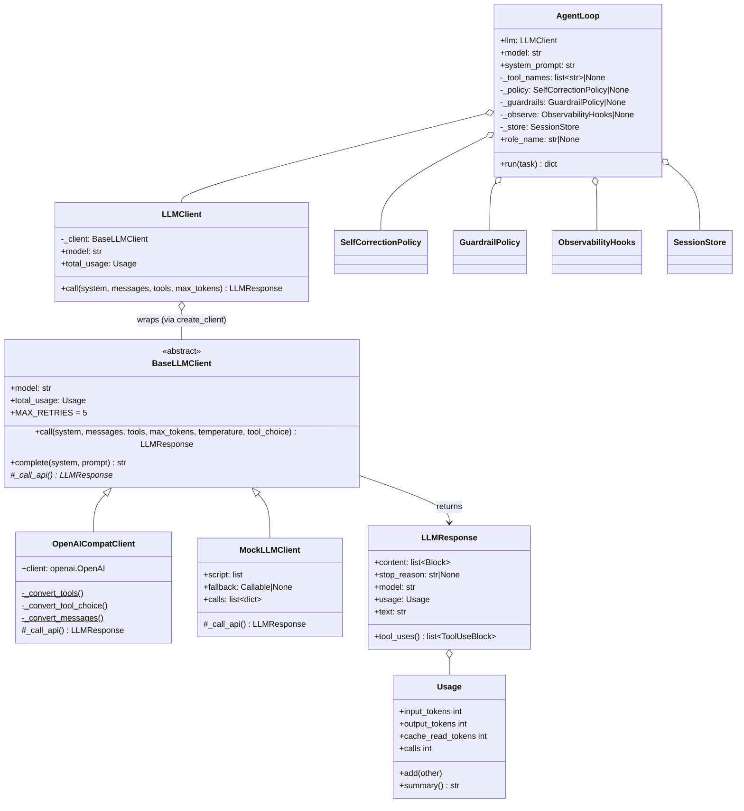
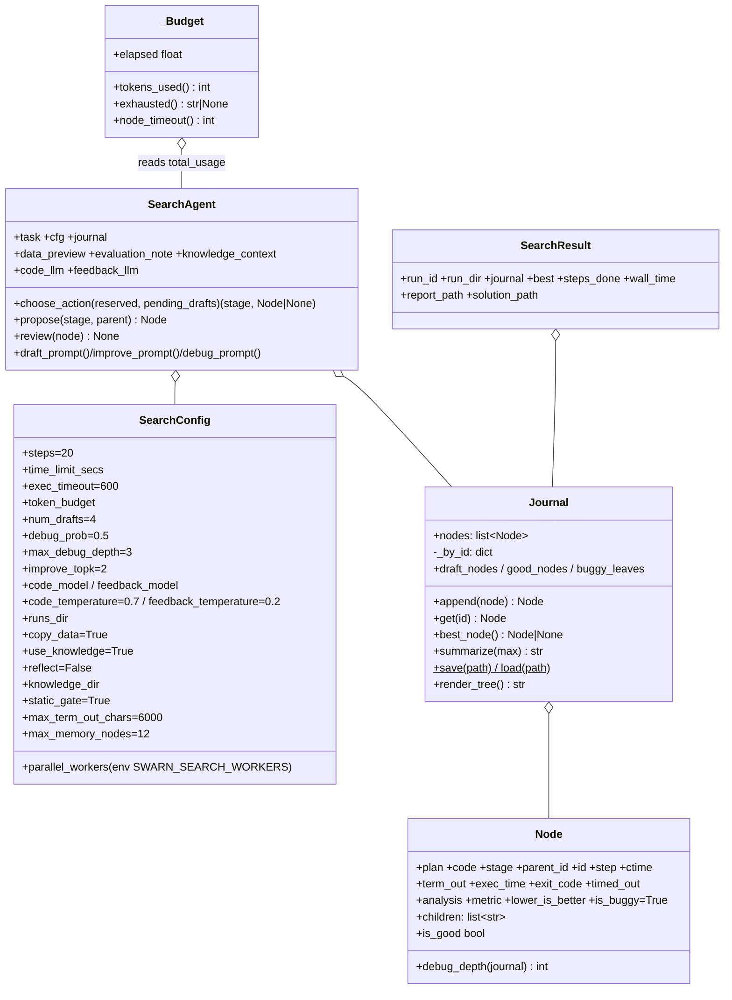
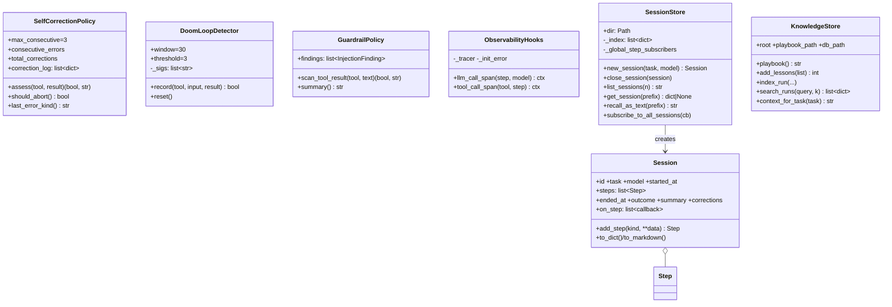

# 06 — Class Design

All important classes, grouped by subsystem. "Created by / used by" is verified from call
sites.

## Class diagram — core



### `AgentLoop` (`agent_loop.py`)
- **Lifecycle:** long-lived in the REPL (one per process, reused across tasks); fresh per
  request in CLI/dashboard/orchestrator/MCP-server.
- **Creates:** one `Session` + one `DoomLoopDetector` per `run()`.
- **Consumes:** `TOOL_REGISTRY` via `get_tool_definitions`/`run_tool`.
- **Notes:** `model` is display-only; `_tool_names` re-evaluated per iteration.

### LLM classes (`agent/llm/`)
- `BaseLLMClient` — **Template Method**: `call()` owns retries/accounting; `_call_api()` is
  the subclass hook. `total_usage` accumulates across the client's lifetime (clients are
  cached, so usage is per-process per-endpoint unless tests reset it).
- `OpenAICompatClient` — stateless besides the SDK client; all converters are `@staticmethod`.
- `MockLLMClient` — also records every call for assertions; scripted items can be
  callables `(system, messages, tools) -> str|LLMResponse`.
- Blocks: `TextBlock`, `ToolUseBlock` are plain dataclasses with `to_dict()`;
  `block_to_dict()` also accepts raw dicts and (legacy) Anthropic SDK objects.

## Class diagram — search engine



- `Node.is_buggy` defaults **True** ("pessimistic until reviewed").
- `Journal.append` assigns `step = len(nodes)` and wires parent→children; under the
  parallel scheduler this happens inside the runner's lock, keeping steps dense/unique
  (asserted by `test_parallel_resume.py`).
- `SearchResult` is a frozen-shape dataclass returned by `run_search`.

## Class diagram — policies, memory, knowledge



## Class diagram — capability singletons

```mermaid
classDiagram
    class DataPipeline {
        +datasets: dict~str, DataFrame~
        +load_csv/excel/parquet/sql/cloud_storage
        +validate_dataset(name) str
        +preview/list/save_dataset
    }
    class FeatureEngine {
        -_fitted_transformer
        -_fitted_feature_names
        -_fitted_target_col
        +profile_dataset(name, target) str
        +engineer_features(name, target, drop, out) str
    }
    class ModelTrainer {
        -_trained_models: dict~str, artifact~
        -_last_leaderboard
        +train_models(...) str
        +tune_hyperparameters(...) str
        +get_trained_model(id) dict|None
        +list_trained_models() str
    }
    class ModelEvaluator {
        +evaluate_model(id) str
        +plot_confusion_matrix/roc_curve/residuals(id) str
        +compare_models() str
    }
    class DeploymentPackager {
        +package_model(id, format, title) str
    }
    class FineTuner {
        -_runs: dict~str, dict~
        +prepare_dataset(examples, run_id, split) str
        +fine_tune(run_id, base_model_id, ...) str
        +merge_and_export(run_id, mode) str
    }
    class ContextEngine {
        -_ready -_collection -_embedder
        +index_directory(dir) str
        +search(query, n) str
        -_chunk_python()/-_chunk_text()
        +_make_chunk()$ +_make_id()$
    }
    class MultiModalIndexer {
        +index_pdf(path) str
        +index_image(path, caption) str
        +index_audio(path, model_size) str
    }
    class MCPManager {
        -_loop -_loop_thread -_servers -_lock
        +connect_server(name, cmd, args) str
        +call_mcp_tool(server, tool, args) str
        +disconnect_server(name) str
        +list_mcp_servers()/list_mcp_tools()
        +shutdown()
    }
    class Sandbox {
        +exec_python(code, timeout) str
        +exec_shell(cmd, timeout) str
        +close()
    }
    class SubprocessBackend {
        +workspace
        +exec_python/exec_shell ExecResult
    }
    class DockerBackend {
        +workspace +image +mem_limit +cpu_count
        -_container -_lock
        +exec_python/exec_shell ExecResult
        -_recycle_container()
        +close()
    }
    FeatureEngine ..> DataPipeline : reads registry
    ModelTrainer ..> DataPipeline : reads registry
    ModelEvaluator ..> ModelTrainer : reads artifacts
    DeploymentPackager ..> ModelTrainer : reads artifacts
    MultiModalIndexer ..> ContextEngine : same collection/embedder
    Sandbox ..> SubprocessBackend : via get_backend()
    Sandbox ..> DockerBackend : via get_backend()
    MCPManager ..> "TOOL_REGISTRY (tools.py)" : registers/removes
```

**Artifact dict shape** (the implicit contract between `ModelTrainer`, `ModelEvaluator`,
`DeploymentPackager`):
```python
{
  "model": <fitted estimator | torch nn.Sequential>,
  "task_type": "regression" | "binary_classification" | "multiclass_classification",
  "metrics": {"rmse"|"accuracy": float, ...},
  "feature_columns": list[str],
  "target_col": str,
  "candidate": str,                # e.g. "xgboost", "xgboost_tuned"
  "best_params": dict,             # HPO only
  "X_test": DataFrame, "y_test": Series,   # held-out split, reused by Phase 9
}
```

## Orchestration classes

- `RoleRun` (dataclass): `role, task, outcome, summary, session_id` — one pipeline step.
- `BlackboardState` (dataclass): `original_task`, `history: list[RoleRun]`,
  `revisions: int`; helpers `last()`, `summary_of(role)` (the latter is defined but not
  called anywhere in the codebase).
- `Orchestrator`: fields `model`, `include_tester`, `_guardrails`, `_observe`; methods
  `_run_role`, `_verdict_is_approval` (static), `run`, `_finish`, `_render_report`.

## Dashboard / MCP-server classes

- `ConnectionManager` (`dashboard.py`): `active: set[WebSocket]`, `_queue`, `_loop`;
  `bind_to_running_loop`, `on_step` (thread-safe producer via
  `run_coroutine_threadsafe`), `broadcast_loop` (async consumer).
- `RunRequest` (pydantic): `{task, model=DEFAULT_MODEL}`.
- `_TaskRecord` (`mcp_server.py`): `id, task, mode, status(running|complete|failed),
  result, messages, started, finished`.

## Singleton accessors (complete list)

| Accessor | Module | Instance |
|---|---|---|
| `get_session_store()` | memory.py | SessionStore |
| `get_context_engine()` | context_engine.py | ContextEngine |
| `get_multimodal_indexer()` | multimodal_rag.py | MultiModalIndexer |
| `get_data_pipeline()` | data_pipeline.py | DataPipeline |
| `get_feature_engine()` | feature_engineering.py | FeatureEngine |
| `get_model_trainer()` | model_training.py | ModelTrainer |
| `get_model_evaluator()` | evaluation.py | ModelEvaluator |
| `get_deployment_packager()` | deployment.py | DeploymentPackager |
| `get_fine_tuner()` | finetuning.py | FineTuner |
| `get_mcp_manager()` | mcp_integration.py | MCPManager |
| `get_sandbox()` / `get_backend()` | sandbox.py / execution.py | Sandbox / backend |
| `get_guardrail_policy()` / `get_benchmark_harness()` / `get_observability_hooks()` | observability.py | policy/harness/hooks |
| `create_client()` (cached) | llm/router.py | BaseLLMClient per endpoint key |

Note the subtlety: the `get_guardrail_findings` **tool** reads the module singleton
`get_guardrail_policy()`, while `main.py`/`cli.py` construct their **own** `GuardrailPolicy`
instances for the loop — so findings the loop collects are not the findings the tool
reports (see [22_Technical_Debt.md](22_Technical_Debt.md)).
