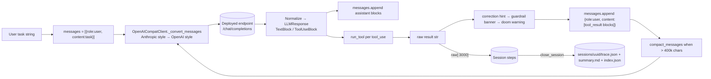
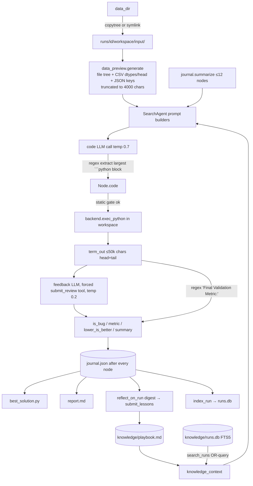
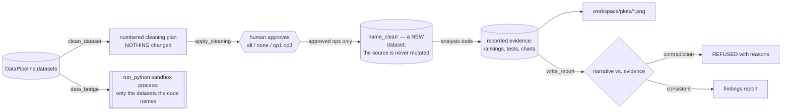
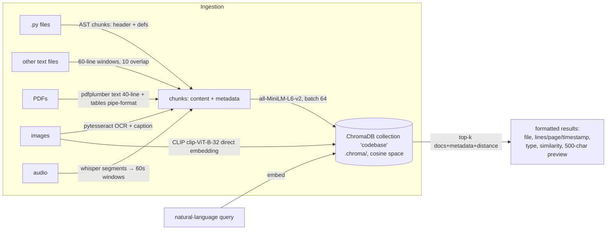

# 07 — Data Flow

## 1. Conversation data (ReAct loop)



Key transformations:
- **Origin:** user input (REPL/CLI arg/HTTP body/MCP tool arg).
- **Wire format:** the whole codebase speaks *Anthropic-style* messages internally
  (`base.py` docstring); `OpenAICompatClient` converts both directions at the boundary.
  Tool schemas: Anthropic `{name, description, input_schema}` →
  OpenAI `{type:"function", function:{name, description, parameters}}`.
- **Enrichment order** (fixed, documented): self-correction → guardrail → doom-loop.
- **Divergence:** session traces store raw truncated results; the LLM sees enriched ones.
- **Serialization:** `Session.to_dict()` → `trace.json` (steps carry `kind/time/data`);
  `to_markdown()` → `summary.md`; index entries capped at 100.

## 2. Tree-search data



- Script contract: read from `./input`, write outputs to `./`, print
  `Final Validation Metric: <number>` (enforced by prompt + static gate + review fallback).
- The regex-printed metric **wins** over the reviewer's extracted metric on disagreement.
- `term_out` shown to the reviewer is tail-truncated to `max_term_out_chars` (6,000).

## 3. Tabular ML pipeline data (Phases 6–10)

```mermaid
flowchart LR
    SRC["CSV / Excel / Parquet<br/>SQL query / s3:// / gs://"] -->|load_*| REG[(DataPipeline.datasets<br/>in-memory DataFrames)]
    REG -->|validate_dataset| VREP[text report: dtypes, nulls,<br/>dupes, z-outliers, pandera]
    REG -->|profile_features| PROF[role suggestions + task hint]
    REG -->|engineer_features| FE[datetime decompose →<br/>freq-encode high-card →<br/>ColumnTransformer fit_transform]
    FE -->|register| REG2[("'name_features' DataFrame<br/>+ target col appended")]
    REG2 -->|train_models| SPLIT[train_test_split 80/20<br/>stratified for classification<br/>random_state=42]
    SPLIT --> FIT[candidates fit + metrics]
    FIT --> ART[(ModelTrainer._trained_models<br/>artifact incl. X_test/y_test)]
    ART -->|evaluate_model / plots| PNG[workspace/plots/*.png]
    ART -->|package_model| DEP[workspace/deployments/id/<br/>model.joblib|onnx, app.py,<br/>requirements.txt, Dockerfile, metadata.json]
    REG -->|save_dataset| FILE[workspace/*.csv|parquet]
```

- Datasets live **only in memory** unless `save_dataset` is called (documented "storage
  model" in `data_pipeline.py`).
- The held-out split is stored on the artifact so evaluation/plots reuse the *same* sample
  the leaderboard used (`evaluation.py` docstring).
- Deployment's API schema is generated from `feature_columns` — the input contract is the
  training columns, sanitized to Python identifiers.

### 3a. The analyst path off the same registry

The same `DataPipeline.datasets` registry feeds a second, non-ML flow:



- **Nothing is destroyed without a human.** `clean_dataset` only proposes; `apply_cleaning`
  blocks, applies the approved subset, and writes a new dataset. `SWARN_AUTO_APPROVE`/`/yolo`
  removes this gate.
- **Evidence flows one way.** Analysis tools record what they measured; `write_report`
  regenerates figures from that record and refuses a narrative that contradicts it — so the
  numbers in the report cannot drift from the numbers that were computed.
- **Crossing the process boundary.** The registry is in-process; `run_python` is not.
  `data_bridge` materializes only the datasets the code mentions by name and binds them to
  variables via a generated bootstrap.

## 4. RAG index data



- Chunk IDs: `md5(file:start:end:name)` → **upsert** semantics, re-indexing updates in place.
- Metadata `type` field distinguishes modality; `start_line`/`end_line` are repurposed as
  page numbers (PDF/image) or seconds (audio).

## 5. Knowledge data

- **Playbook** (`knowledge/playbook.md`): markdown bullets; write path is
  `reflect_on_run` → `add_lessons` (dedupe, 300-char cap per lesson, drop-oldest to fit
  6,000 chars). Read paths: `context_for_task` (search prompts), `swarn playbook` CLI,
  `GET /api/playbook`.
- **Run archive** (`knowledge/runs.db`): FTS5 rows
  `(run_id, task[:4000], summary[:4000], code[:20000], metric, ts)`; queried by OR-ing up to
  24 word tokens from the new task; top-3 summaries injected as "prior art".

## 6. Live dashboard stream

```
AgentLoop thread                    FastAPI event loop                Browser
Session.add_step ──callback──▶ ConnectionManager.on_step
                                  run_coroutine_threadsafe(queue.put(payload))
                                  broadcast_loop: await queue.get()
                                  ws.send_text(json) ──────────────▶ appendStep()
```

Payload: `{session_id, task[:120], kind, timestamp, data}` (`dashboard.py:146–152`).
No buffering: steps emitted while zero clients are connected are dropped from the live
feed (still persisted at close).

## 7. MCP tool-call data

Outbound: agent tool_use → registered closure → `call_mcp_tool(server, tool, kwargs)` →
queue `(tool, args, future)` → owner task → `session.call_tool` → MCP server subprocess.
Inbound: MCP content blocks → `_extract_text` flattens text blocks; images/resources become
placeholder strings; result returns through the future as a plain string.

## Validation summary (where data gets checked)

| Boundary | Validation |
|---|---|
| Tool inputs | JSON schema in tool definitions (enforced by the LLM provider's function-calling; `run_tool` itself does not validate — a bad kwarg becomes a `TypeError` string) |
| Workspace paths | `_safe_path` in `tools.py` and `data_pipeline.py` |
| Datasets | `validate_dataset` (advisory report, never blocks) |
| Feature matrix | `train_models` rejects non-numeric columns with a directive error string |
| Fine-tune examples | `prepare_dataset` field/type/emptiness checks per example |
| Search code | `static_check` AST gate |
| Review output | `_parse_review`: forced tool call → fallback regex-JSON extraction → None |
| MCP server names/tools | sanitized to identifier-safe names (`_make_local_name`) |
