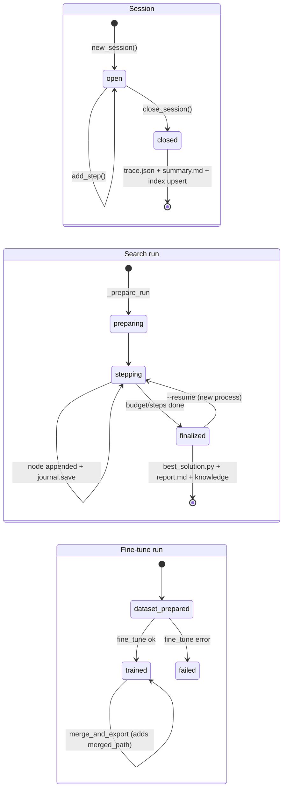

# 08 — State Management

## Inventory of all state

### A. In-memory, per-process (lost at exit)

| State | Owner | Created | Mutated by | Notes |
|---|---|---|---|---|
| `TOOL_REGISTRY` | `tools.py` (module global) | import time (decorators run) | `MCPManager` connect/disconnect | The only *mutable* registry; everything else registers at import |
| LLM client cache `_client_cache` | `llm/router.py` | first `create_client` | never evicted | Keyed `deployed:<model>@<url>` / `mock:<name>` |
| `BaseLLMClient.total_usage` | each client | client init | every successful call | Basis for search token budgets (tests reset it manually) |
| Dataset registry `DataPipeline.datasets` | data_pipeline singleton | first load_* | load/engineer/save tools | DataFrames; nothing persisted implicitly |
| Fitted transformer `_fitted_transformer` | FeatureEngine singleton | `engineer_features` | each call overwrites | Single-slot; no API reads it back (see Tech Debt) |
| Trained artifacts `_trained_models` | ModelTrainer singleton | train/tune | new artifacts added | Includes live model objects + X_test/y_test DataFrames |
| Fine-tune runs `_runs` | FineTuner singleton | prepare_dataset | fine_tune/merge | Status machine: dataset_prepared → trained → (+merged_path) / failed |
| MCP servers `_servers` | MCPManager singleton | connect_server | disconnect_server | request_queue + task_future + tool names per server |
| Guardrail `findings` | each GuardrailPolicy instance | construction | every flagged scan | Per-session by design; NB: loop instances ≠ module singleton |
| Correction counters | each SelfCorrectionPolicy | construction | `assess()` | `consecutive_errors` reset on success (and by REPL between tasks) |
| Doom-loop `_sigs` | per `run()` | each run | each tool call | Sliding window of 30 md5 signatures |
| Session (open) | AgentLoop.run | `new_session` | `add_step` | Exists only in memory until `close_session` |
| Dashboard `_TASKS` | mcp_server module | submit | worker thread | Task records with transcript lines |
| WebSocket set `active` + queue | ConnectionManager | startup | connect/disconnect/steps | Steps dropped when no clients |
| ChromaDB embedder/collection handles | ContextEngine singleton | first index/search | — | Lazy; `_clip_embedder` attached dynamically by multimodal_rag |
| Process-wide execution backend `_backend` | execution.py | first ReAct exec tool | `close_backend()` | Search runs use their own per-run backends instead |

### B. On-disk, durable

| Path | Format | Writer | Reader | Written when |
|---|---|---|---|---|
| `sessions/index.json` | JSON list (≤100 entries) | `SessionStore._update_index` | list/history/dashboard | every `close_session` |
| `sessions/<uuid>/trace.json` | full `Session.to_dict()` | `_persist` | `get_session`/recall/dashboard | at close only |
| `sessions/<uuid>/summary.md` | markdown replay | `_persist` | humans | at close only |
| `runs/<id>/journal.json` | `{"nodes":[Node.to_dict()…]}` | `Journal.save` | resume, dashboard `/api/runs*` | **after every node** (crash-safe) |
| `runs/<id>/best_solution.py` | winning script | runner finalize | user | end of run |
| `runs/<id>/report.md` | markdown | `write_report` | user, dashboard | end of run |
| `runs/<id>/workspace/` | staged `input/` + script outputs | backend execs | scripts themselves | during run |
| `knowledge/playbook.md` | markdown bullets (≤6,000 chars) | `add_lessons` | search prompts, CLI, dashboard | after reflective runs |
| `knowledge/runs.db` | SQLite FTS5 | `index_run` | `search_runs` | end of every knowledge-enabled run |
| `.chroma/` | ChromaDB persistent store | index tools | `search_codebase` | on indexing |
| `workspace/**` | agent-created files, plots/, deployments/, finetune/ | tools | tools/user | on demand |
| `.env` | env overrides | user | `load_dotenv` (main.py + router import) | — |

### C. External state

- The Docker container (persistent per backend instance; killed on timeout, recreated
  lazily; `auto_remove=True`).
- MCP server subprocesses (one per connected server; owned by the manager's event loop task).
- The deployed LLM endpoint is stateless from the client's perspective (full message list
  resent each call; no caching headers or session ids in the code).

## Ownership & synchronization

- **Journal (parallel search):** guarded by a single `threading.Lock` in `run_search` —
  `choose_action` (reads + reservation computation) and `append`+`save` happen under the
  lock; execution/review happen outside it. `Journal` itself is not thread-safe; safety is
  the runner's responsibility.
- **DockerBackend:** `_lock` guards container creation/recycle; `exec_run` happens in a
  watcher thread.
- **MCPManager:** `_lock` guards loop startup and `_servers`; all MCP I/O is serialized
  through each server's single owner task (anyio cancel-scope requirement).
- **SessionStore / singletons in general:** no locking. The lazy `get_xxx()` initializers
  are not thread-safe (benign race: two instances could be created). Session `add_step`
  callbacks may fire cross-thread into the dashboard's thread-safe queue bridge.
- **mcp_server `_TASKS`:** `_LOCK` held for insertion; reads are unguarded (CPython dict
  reads are atomic enough for this display-only use).

## State lifecycles

## Cross-process implications (verified, documented in code)

`get_session_store()` is per-process; therefore a run in process A is invisible to the
dashboard in process B until it closes and appears in `index.json` (dashboard polls
`/api/sessions` every 5s client-side). This is the *entire reason* `POST /api/run` exists —
to run the agent inside the dashboard's process so its steps hit the subscribed store
(`dashboard.py` module docstring).

Similarly, artifacts/datasets are per-process: a model trained via `swarn run` cannot be
evaluated by a later `swarn run` invocation (new process, empty `ModelTrainer`). Only
disk-backed state (sessions, runs, knowledge, chroma, workspace files) crosses process
boundaries.

## Checkpointing & recovery

- **Tree search:** `journal.json` saved after every node makes runs resumable:
  `swarn solve --resume <run_id>` (`_resume_run` reloads the journal; `--steps` adds nodes).
  The staged `workspace/input` from the original run is reused; the workspace dir is
  recreated if missing.
- **ReAct sessions:** no mid-run checkpointing — a crash loses the open session entirely
  (nothing is written before `close_session`). TOOL_CALL-before-execution logging protects
  against *tool* hangs within a surviving process, not process death.
- **Knowledge:** best-effort; failures never propagate.
