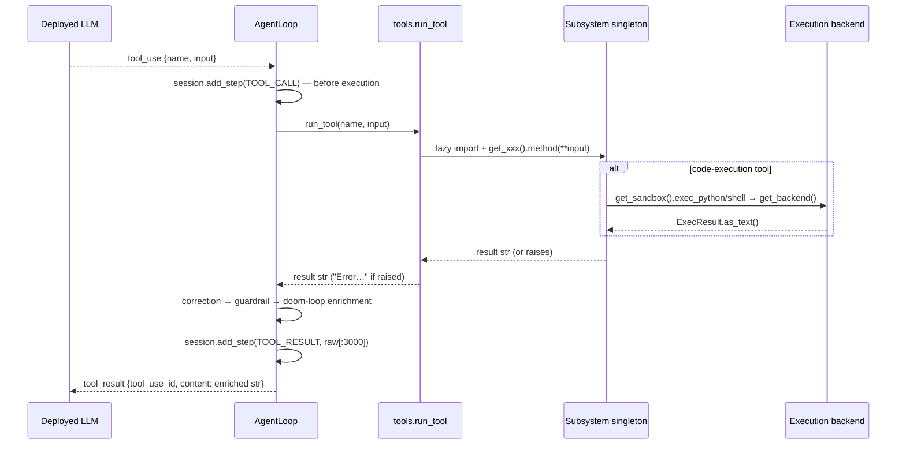

# 09 — Tool Execution

Files: `agent/runtime/tools.py` (registry + 55 built-ins), `agent/runtime/execution.py` + `agent/runtime/sandbox.py`
(code execution), `agent/integrations/mcp_integration.py` (dynamic remote tools),
`agent/data_cleaner.py` / `data_analysis.py` / `data_report.py` / `workbook.py` (20 lazily
registered analyst tools). **75 tools total.** For the user-facing catalog with every
argument, see [../TOOLS.md](../TOOLS.md).

## The registry

```python
TOOL_REGISTRY: dict[str, dict] = {}   # name -> {"description", "schema", "func"}

@tool(description=..., schema={...json schema...})
def my_tool(arg: str) -> str: ...
```

The `@tool` decorator (`tools.py:97–109`) registers the function under `func.__name__` at
import time. Two consumers:

- `get_tool_definitions(names=None)` → Anthropic-format list
  `[{"name", "description", "input_schema"}]`. Allow-list semantics:
  - `names is None` → all tools (single-agent default).
  - `"connect_mcp_server" in names` → the named tools **plus** every tool whose name starts
    with `mcp_` (so a role trusted to open MCP connections can also use the tools those
    connections register mid-run — the documented Phase 11×12 interaction, `tools.py:126–145`).
  - otherwise → exactly the named tools; unknown names silently skipped (a role config typo
    shortens the list rather than crashing).
- `run_tool(name, tool_input)` → dispatch with `**tool_input`; returns
  `"Error: unknown tool '<name>'"` or `"Error running '<name>': <Type>: <msg>"` on any
  exception. **Never raises** — the foundation of the self-correction loop.

## Tool invocation flow



## Complete built-in tool catalog (registration order in `tools.py`)

| Phase | Tools | Backed by |
|---|---|---|
| 1 | `list_files`, `read_file`, `write_file`, `finish_task` | direct fs + `_safe_path` |
| 2 | `run_python`, `run_shell`, `install_package` | `sandbox.get_sandbox()` → process-wide backend |
| 3 | `index_project`, `search_codebase` | `context_engine` |
| 5 | `list_sessions`, `recall_session` | `memory` |
| 6 | `load_csv`, `load_excel`, `load_parquet`, `load_sql`, `load_cloud_data`, `validate_dataset`, `preview_dataset`, `list_datasets`, `save_dataset` | `data_pipeline` |
| 7 | `profile_features`, `engineer_features` | `feature_engineering` |
| 8 | `train_models`, `tune_hyperparameters`, `list_trained_models`, `save_model`, `delete_model` | `model_training` |
| 9 | `evaluate_model`, `plot_confusion_matrix`, `plot_roc_curve`, `plot_residuals`, `compare_models`, `feature_importance`, `predict` | `evaluation` / `model_training` |
| 10 | `package_model` | `deployment` |
| 12 | `connect_mcp_server`, `list_mcp_servers`, `list_mcp_tools`, `disconnect_mcp_server` | `mcp_integration` |
| 13 | `index_pdf`, `extract_pdf_structured`, `extract_pdf_document`, `index_image`, `index_audio` | `multimodal_rag` / `swarn.capabilities.doc_structure` |
| doc | `swarn_doc_inspect`, `swarn_pdf_to_csv`, `swarn_doc_ingest`, `swarn_doc_ask` | `swarn.capabilities.*` (lazy import; one-way dependency) |
| 14 | `prepare_finetune_dataset`, `fine_tune`, `merge_and_export_model`, `list_finetune_runs` | `finetuning` |
| 15 | `run_guardrail_benchmark`, `get_guardrail_findings` | `observability` |
| V2 | `solve_ml_task` | `agent.search.run_search` |
| dynamic | `mcp_<server>_<tool>` … | `MCPManager.call_mcp_tool` closures |

## Lazily registered analyst tools

The 20 remaining tools are **not** registered at `tools.py` import time. Each owning module
holds a `_SWARN_TOOLS` dict of `name -> (description, schema, fn)` and a `register_*()`
function that inserts them into the same `TOOL_REGISTRY`, **skipping any name already
present** so a second call is a no-op and a built-in always wins a collision. The CLI calls
these during boot; anything driving the registry directly must call them itself, or the
tools simply will not exist.

| Module | Tools | Notes |
|---|---|---|
| `data_cleaner.py` | `clean_dataset`, `apply_cleaning`, `ask_human`, `describe_dataset`, `group_dataset` | `apply_cleaning` **blocks on human approval** and applies only approved ops into `<name>_clean`; the source dataset is never mutated. |
| `data_analysis.py` | `analyze_dataset`, `plot_column`, `plot_relationship`, `analyze_correlations`, `check_subgroups`, `compare_groups`, `rank_by`, `analyze_missing`, `analyze_multivalue`, `pivot_dataset`, `analyze_over_time`, `measure_duration` | Charts go to `workspace/plots/` **and** are described in words — the agent cannot see the PNG. `rank_by` records its ranking; a report naming a different top N is refused. |
| `data_report.py` | `write_report` | Narrative from the model, figures from recorded evidence; contradictions are refused with reasons rather than rendered. |
| `workbook.py` | `inspect_workbook`, `load_workbook` | Whole-workbook Excel structure and multi-sheet loading. |

`finish_task(summary)` is special only by convention: it returns `"TASK_COMPLETE: …"` like
any tool, but `AgentLoop` checks `block.name == "finish_task"` to end the run and record the
summary.

`ask_human` and `apply_cleaning` are the two tools that **block on a human**, and
`agent/core/approval_policy.py` gates other tool calls the same way. `SWARN_AUTO_APPROVE=1`
(or `/yolo` in the REPL) bypasses the gate — which also removes the guarantee that no
destructive data operation runs unreviewed.

## Reaching loaded datasets from the sandbox

`run_python` executes in a *different process* from the dataset registry, so a loaded
DataFrame is not simply importable there. `agent/data_bridge.py` closes the gap: before the
code runs it scans it for dataset names, materializes **only those** to the workspace, and
prepends a generated bootstrap binding them to plain variables. A session holding twenty
datasets pays for the two a given query touches. This is why `run_python`'s description can
promise that "loaded datasets are already available here as pandas DataFrames" while also
refusing a stale `pd.read_csv()`.

## The workspace path guard

`safe_path(path)` (`paths.py:32–37`, imported into `tools.py` as `_safe_path`):
`abspath(join(WORKSPACE_DIR, path))` must equal `WORKSPACE_DIR` or start with
`WORKSPACE_DIR + os.sep`, else `ValueError` ("escapes the workspace directory"). Applied to
all Phase-1 file tools and Phase-6 file loaders. **Not** applied to: `index_project` /
`index_pdf` / `index_image` / `index_audio` (absolute paths outside the workspace are an
explicit feature there), `load_sql`/`load_cloud_data` (remote), or shell/python execution
(the sandbox is the boundary there, not the path guard).

## Code execution backends

Selection (`execution.make_backend`): `SWARN_SANDBOX=subprocess|docker` forces; otherwise
Docker if `docker.from_env().ping()` succeeds, else subprocess. Two instantiations:

- **Process-wide** (`get_backend()`), used by `run_python`/`run_shell`/`install_package`
  through the `Sandbox` facade; workspace = repo `workspace/`.
- **Per-search-run** (`make_backend(runs/<id>/workspace)`), closed in the runner's
  `finally`.

| Property | SubprocessBackend | DockerBackend |
|---|---|---|
| Isolation | none (documented trade-off) | container; mem 2g, 2 CPUs; workspace bind-mount rw |
| Python | `sys.executable` (Windows-safe) | `python3` inside `python:3.11-slim` (override `SWARN_SANDBOX_IMAGE`) |
| Timeout | `subprocess.run(timeout=…)`; partial output preserved from `TimeoutExpired` | watcher thread `join(timeout)`; on expiry the **container is killed and recreated** (a single exec can't be killed) — the V3 fix for runaway processes |
| Result | `ExecResult(output ≤50k head+tail, exit_code, timed_out, exec_time)` | same |
| Shell | `bash -c` (POSIX) / `cmd /c` (Windows) | `bash -c` in container |
| Package install | pip into the *host env* | pip into the container (persists for container lifetime) |

`ExecResult.as_text()` produces the legacy display strings the correction policy pattern-
matches: `"Error: command timed out after Ns"`, `"[exit N]"` prefix, `"(no output)"`.

## Dynamic MCP tools

`connect_mcp_server(server_name, command, args)`:

1. `MCPManager` ensures the background asyncio loop thread is running.
2. Creates a request `asyncio.Queue` + readiness future on that loop.
3. Schedules `_server_task_main(...)` — the **single owner task** that:
   opens `stdio_client(StdioServerParameters(command, args, env))` + `ClientSession` in an
   `AsyncExitStack`, calls `initialize()` and `list_tools()`, registers each remote tool in
   `TOOL_REGISTRY` as `mcp_<safe_server>_<safe_tool>` with description prefix
   `[MCP: <server>]` and the server's `inputSchema`, resolves the readiness future, then
   loops servicing `(tool, args, response_future)` requests until a `None` sentinel, and
   finally closes the exit stack *in the same task* (anyio cancel-scope requirement,
   documented at length in the module).
4. `connect_server` blocks (≤30s) on readiness and records
   `{request_queue, task_future, tools, command}` in `_servers`.

Calls: the registered closure → `call_mcp_tool` → `_run_coro(_submit_call(...))` (60s
timeout) → owner task → `session.call_tool` → `_extract_text` flattens text blocks
(images/resources become placeholders). Errors and timeouts return strings, matching the
registry contract.

`disconnect_server`: sentinel → wait ≤15s for owner task → pop each `mcp_*` name from
`TOOL_REGISTRY` → remove server entry.

Because `AgentLoop` re-fetches tool definitions each iteration, tools registered by a
`connect_mcp_server` call become callable on the **very next** LLM turn.

## `solve_ml_task` — the search engine as a tool

`tools.py:1224–1243`: builds `SearchConfig(steps, time_limit_secs)` (all other config
defaults apply, including `use_knowledge=True`, `reflect=False`, `parallel_workers` from
env), wraps `run_search` in try/except → error string, and formats the result (best metric,
solution path, report path). This is the bridge that lets the ReAct agent delegate whole ML
tasks to the tree search.
