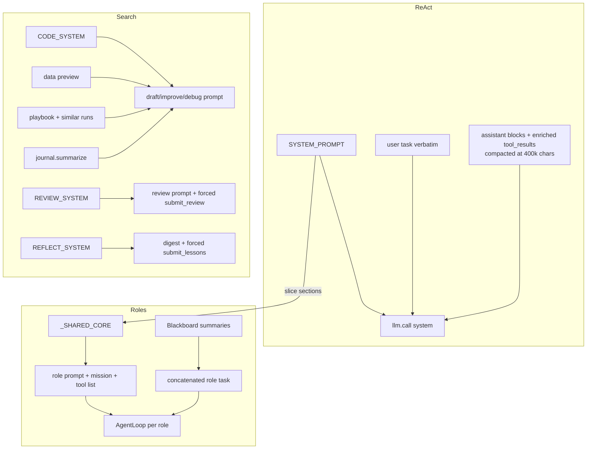

# 10 — Prompt Construction

There are three prompt families, each built differently.

## 1. Single-agent system prompt (`agent/prompts.py`)

`SYSTEM_PROMPT` is one static ~170-line string with `━━━`-delimited sections:

1. **Identity** — "You are Swarn, an autonomous engineering agent…"
2. **Core operating loop** — plan → small verifiable steps → read results → diagnose before
   retry → be transparent → `finish_task` only when fully complete.
3. **Self-correction (Phase 4)** — documents the exact hint format the policy injects
   (`⚠ SELF-CORRECTION [attempt N/3 …]`) and the 3-consecutive-error abort.
4. **Available tools** — the full catalogue grouped by phase, each with a recommended
   workflow line (e.g. `load_* → validate_dataset → profile_features`), including the
   directive to **prefer `solve_ml_task`** for maximum-performance modeling tasks and the
   guardrail-warning interpretation rules (treat flagged embedded instructions as untrusted).
5. **Workspace** — relative paths resolve inside the workspace; `/workspace` in Docker maps
   to it.
6. **Ambiguity policy** — assume, state the assumption, proceed.

It is passed verbatim as the `system` parameter on every `AgentLoop` LLM call (converted to
an OpenAI `system` message by `OpenAICompatClient._convert_messages`).

The **user prompt** for the single agent is simply the raw task string; all subsequent
turns are assistant blocks + `tool_result` blocks. No templating.

## 2. Role prompts (`agent/roles.py`)

Built **at import time** from `SYSTEM_PROMPT`:

```python
_SHARED_CORE = _extract_shared_core(SYSTEM_PROMPT)
# = SYSTEM_PROMPT["━━━ Core operating loop ━━━" : "━━━ Available tools ━━━"]
#   + SYSTEM_PROMPT["━━━ Workspace ━━━" :]        # workspace + ambiguity sections
ROLE_PROMPT = _SHARED_CORE + "━━━ Your role: X ━━━\n<mission>" (+ role tool list)
```

The giant tool catalogue is deliberately excluded (each role gets a much shorter,
role-appropriate list appended; Planner's prompt has no tool list section at all — its
tools are described in prose). Missions (verbatim intent):

- **PLANNER** — read/inspect only; produce a numbered, tool-aware plan; call `finish_task`
  with the plan as summary; "be concrete enough that the Coder could follow it without
  asking".
- **CODER** — execute the plan with the full file/sandbox/RAG/ML toolset; deviate with
  judgment; summary must name every file and artifact_id produced.
- **REVIEWER** — independently verify (read files, run evaluation tools); verdict
  `APPROVED` or `NEEDS_CHANGES` with specifics, as the summary.
- **TESTER** — actually execute things; report `PASS`/`FAIL` with real output.

The orchestrator then builds each role's **task prompt** by string concatenation
(`orchestrator.py:206–269`): original task + upstream summaries + directive, e.g.

```
Original task: {task}

Your previous summary:
{coder_summary}

The Reviewer found issues:
{reviewer_summary}

Fix these specific issues.
```

## 3. Search-engine prompts (`agent/search/agent.py`)

Two static system prompts:

- `CODE_SYSTEM` — "expert ML engineer" rules: short plan + **exactly one** ```python block,
  self-contained script, read `./input`, write `./`, must print
  `Final Validation Metric: <number>`, prefer fast baselines, no placeholders.
- `REVIEW_SYSTEM` — "strict ML experiment reviewer": decide buggy, extract metric.

User prompts are assembled per stage:

```
_task_header() =
  "# Task\n{task}"
  [+ "# Evaluation\n{evaluation_note}"]      # only when caller passes one
  [+ "# Data overview\n{data_preview}"]      # data_preview.generate(), ≤4000 chars
  [+ knowledge_context]                       # playbook + similar past runs

draft_prompt   = header + "# Memory (previous attempts)\n{journal.summarize(12)}"
                 + instructions: NEW approach, meaningfully different, simple & reliable
improve_prompt = header + "# Current best solution (metric)\n```python…```"
                 + memory + instructions: ONE atomic improvement
debug_prompt   = header + "# Buggy solution\n```python…```"
                 + "# Execution output\n```{term_out[-6000:]}```"
                 + instructions: diagnose root cause, state fix, full fixed script
```

`journal.summarize(max_nodes=12)` renders good nodes as
`— attempt N [stage] metric=… : plan[:300]` and recent buggy nodes as
`— attempt N [stage] FAILED: analysis[:200] or term_out[-200:]` — this is the tree's
"memory" that makes the search converge.

**Review prompt** (`review()`): task[:2000] + code[:8000] + exit code +
term_out[-6000:], with `tools=[REVIEW_TOOL]` and
`tool_choice={"type": "tool", "name": "submit_review"}` (forced structured output;
converted to OpenAI forced function calling by the client).

**Knowledge context** (`knowledge.context_for_task`): the playbook markdown verbatim +
"# Similar past runs (prior art — reuse what worked)" with up to 3 FTS matches
(`run_id`, metric, task[:160], summary[:240]).

**Reflection prompt** (`knowledge.reflect_on_run`): `REFLECT_SYSTEM` (extract ≤5
*generalizable* lessons, reject task trivia, prefer failure lessons) + a digest
(task[:2000], `journal.summarize(20)`, outcome line), with forced `submit_lessons` tool.

## Prompt-flow diagram



## Token/size controls on prompt inputs (all deterministic)

| Input | Cap | Where |
|---|---|---|
| ReAct conversation | 400k chars → old tool_results truncated 700+500 | `agent_loop.compact_messages` |
| Data preview | 4,000 chars, ≤50 files listed, ≤4 file previews | `data_preview.py` |
| Journal memory | 12 nodes, plan[:300]/reason[:200] | `journal.summarize` |
| Exec output to reviewer/debugger | last 6,000 chars | `SearchConfig.max_term_out_chars` |
| Review inputs | task 2,000 / code 8,000 chars | `agent.review()` |
| Plan stored per node | 2,000 chars | `agent.propose()` |
| Playbook | 6,000 chars total, 300/lesson | `knowledge.py` |
| max_tokens | 8,192 default; 1,024 for review/reflection | `base.py`, call sites |
| Temperatures | 0.7 code/agent default; 0.2 review/reflection | `SearchConfig`, call sites |
