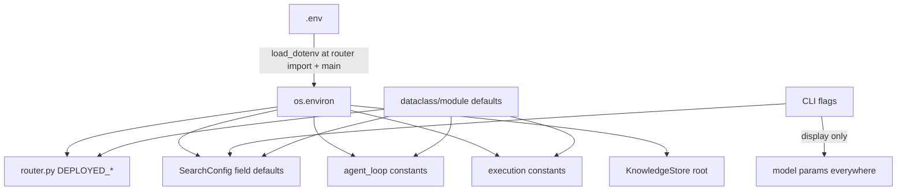

# 11 — Configuration

## Configuration hierarchy (highest precedence first)

1. **Function/CLI arguments** — e.g. `swarn solve --workers 4 --token-budget 500000`,
   `SearchConfig(steps=25)`.
2. **Environment variables** (including those loaded from `.env` by `python-dotenv`).
3. **Code defaults** — dataclass defaults in `SearchConfig`, module constants elsewhere.

`.env` loading happens in two places: `main.main()` and — crucially — **at import of
`agent/llm/router.py`** (`router.py:39`), so every entry point (CLI, dashboard, MCP server)
honors `.env` without its own `load_dotenv()` call.

## Complete environment-variable reference (all verified in code)

| Variable | Default | Read in | Effect |
|---|---|---|---|
| `SWARN_DEPLOYED_MODEL` | `qwen3.5-9b` | `llm/router.py` (import) | Served model name for all LLM calls |
| `SWARN_DEPLOYED_BASE_URL` | Modal test URL (`…modal.run/v1`) | `llm/router.py` | OpenAI-compatible `/v1` base URL |
| `SWARN_DEPLOYED_API_KEY` | `dummy` | `llm/router.py` | Bearer key for the endpoint |
| `SWARN_SANDBOX` | *(auto-detect)* | `execution.make_backend` (per call) | Force `docker` or `subprocess` |
| `SWARN_EXEC_TIMEOUT` | `300` | `execution.py` (import) | Default per-exec timeout (s) for ReAct tools |
| `SWARN_SANDBOX_IMAGE` | `python:3.11-slim` | `execution.py` (import) | Docker image |
| `SWARN_MAX_ITERATIONS` | `30` | `agent_loop.py` (import) | ReAct iteration cap |
| `SWARN_CONTEXT_CHAR_BUDGET` | `400000` | `agent_loop.py` (import) | Compaction threshold (chars) |
| `SWARN_SEARCH_WORKERS` | `1` | `SearchConfig` field default (instantiation) | Parallel search workers |
| `SWARN_CODE_MODEL` / `SWARN_FEEDBACK_MODEL` | deployed model | `SearchConfig` field defaults | Display labels; **only `mock:*` changes routing** (tests) |
| `SWARN_KNOWLEDGE_DIR` | `<repo>/knowledge` | `KnowledgeStore.__init__` | Playbook + runs.db location |
| `SWARN_ENABLE_TRACING` | unset | `main.py` only | `"1"` wires `ObservabilityHooks` into the REPL's AgentLoop |
| `OTEL_EXPORTER_ENDPOINT` | unset | `main.py` → `ObservabilityHooks` | OTLP gRPC target; console exporter otherwise |
| `OPENAI_API_KEY` | — | `openai_client.py` fallback | Used only if no key passed (deployed path always passes one) |
| `NO_COLOR` | — | Rich (via `ui.py`) | Disables ANSI colors |
| AWS/GCP credential vars | — | pandas/boto3/gcsfs | Only for `load_cloud_data` |

**Read-at-import caveat:** `SWARN_MAX_ITERATIONS`, `SWARN_CONTEXT_CHAR_BUDGET`,
`SWARN_EXEC_TIMEOUT`, `SWARN_SANDBOX_IMAGE`, and the `SWARN_DEPLOYED_*` trio are captured
into module constants when their module is first imported; changing them later in-process
has no effect. `SWARN_SANDBOX` and `SWARN_KNOWLEDGE_DIR` are read at use time.

## `SearchConfig` (`agent/search/config.py`) — the one structured config object

| Group | Field | Default | Notes |
|---|---|---|---|
| Budgets | `steps` | 20 | *Additional* nodes when resuming |
| | `time_limit_secs` | None | Also shrinks per-node timeouts (`_Budget.node_timeout`, floor 30s) |
| | `exec_timeout` | 600 | Per-node sandbox timeout |
| | `token_budget` | None | in+out tokens across code+feedback clients |
| Parallelism | `parallel_workers` | env or 1 | ThreadPoolExecutor size |
| Tree policy | `num_drafts` | 4 | Independent roots |
| | `debug_prob` | 0.5 | Debug-vs-improve coin flip |
| | `max_debug_depth` | 3 | Consecutive debug chain cap |
| | `improve_topk` | 2 | Epsilon-greedy pool |
| Models | `code_model`/`feedback_model` | deployed | Display + mock switch |
| | `code_temperature` | 0.7 | |
| | `feedback_temperature` | 0.2 | |
| Environment | `runs_dir` | `<repo>/runs` | |
| | `copy_data` | True | copy vs symlink staging |
| Knowledge | `use_knowledge` | True | Inject playbook + prior art |
| | `reflect` | **False** | Post-run reflection (CLI sets `not --no-learn`; MCP server sets True) |
| | `knowledge_dir` | None → env/default | |
| Gate | `static_gate` | True | AST pre-check |
| Context | `max_term_out_chars` | 6000 | |
| | `max_memory_nodes` | 12 | |

CLI flag → config mapping is in `cli.solve` (`cli.py:126–144`). `--model/-m` sets
`code_model` (and `feedback_model` unless separately given) — which only matters for
`mock:*`.

## Hard-coded configuration worth knowing (no env override)

| Constant | Value | Location |
|---|---|---|
| `MAX_RETRIES` (LLM) | 5 | `llm/base.py` |
| Retry backoff | `min(2^attempt + rand, 30)`s | `llm/base.py` |
| `MAX_CONSECUTIVE_ERRORS` | 3 | `self_correction.py` |
| Doom window / threshold | 30 / 3 | `doom_loop.py` |
| `_KEEP_RECENT_MESSAGES`, `_TRUNC_HEAD/TAIL` | 6, 700/500 | `agent_loop.py` |
| `MAX_REVISION_CYCLES` | 3 | `orchestrator.py` |
| `MAX_OUTPUT_CHARS` (exec) | 50,000 | `execution.py` |
| Docker mem/cpu | 2g / 2 | `execution.DockerBackend` |
| Session index cap | 100 | `memory.py` |
| `PLAYBOOK_MAX_CHARS` / `LESSON_MAX_CHARS` / `MAX_SIMILAR_RUNS` | 6000 / 300 / 3 | `knowledge.py` |
| Embed model / CLIP model | `all-MiniLM-L6-v2` / `clip-ViT-B-32` | `context_engine.py` / `multimodal_rag.py` |
| Chunking | 60 lines / 10 overlap / 300KB max file | `context_engine.py` |
| `HIGH_CARDINALITY_THRESHOLD` | 20 | `feature_engineering.py` |
| `DEFAULT_TEST_SIZE` / `DEFAULT_RANDOM_STATE` | 0.2 / 42 | `model_training.py` |
| `OUTLIER_Z_THRESHOLD` | 3.0 | `data_pipeline.py` |
| MCP call/connect/disconnect timeouts | 60 / 30 / 15 s | `mcp_integration.py` |
| Dashboard port | 8420 | `cli.serve` |
| LoRA defaults | r=8, alpha=16, dropout=0.05, targets q_proj/v_proj | `finetuning.py` |

## Configuration diagram

## The "PRODUCTION ENDPOINT — CHANGE HERE" contract

`router.py` carries a banner documenting the two supported ways to point the system at a
production model: edit the three `DEPLOYED_*` defaults, or set the three `SWARN_DEPLOYED_*`
env vars (which win). Nothing else in the codebase needs to change — verified: every LLM
call site goes through `create_client()`.
