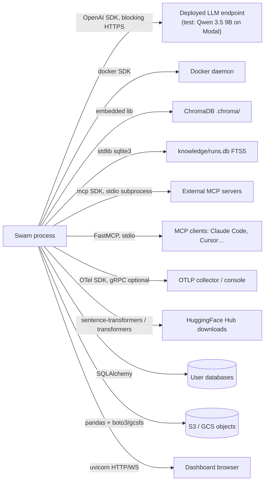

# 12 — External Integrations

## Integration map

## 1. Deployed LLM endpoint (the only LLM provider)

- **Files:** `agent/llm/router.py` (config), `agent/llm/openai_client.py` (client),
  `agent/llm/base.py` (retry shell).
- **Protocol:** OpenAI `/chat/completions` via the official `openai` SDK (lazy-imported).
  Function-calling used for structured outputs (search review, reflection). No streaming.
- **Auth:** `SWARN_DEPLOYED_API_KEY` (default `"dummy"` — the test endpoint is unsecured);
  falls back to `OPENAI_API_KEY` or `"not-needed"` inside the client.
- **Resilience:** 5 retries with jittered exponential backoff on messages matching
  `RETRYABLE_MARKERS` (429/5xx/timeout/connection/overloaded/…); terminal failure raises
  `LLMError`.
- **Accounting:** `Usage` per response, accumulated on `client.total_usage`; drives the
  search token budget and the report's usage line. `cache_read_tokens` exists in the type
  but is never populated by `OpenAICompatClient` (no provider caching integration).

## 2. Docker

- **Files:** `agent/execution.py` (`DockerBackend`, `_docker_available`).
- **Usage:** `docker.from_env()`; one detached container per backend
  (`tail -f /dev/null`, `auto_remove=True`, workspace bind-mounted rw at `/workspace`,
  `mem_limit="2g"`, `cpu_count=2`); commands via `container.exec_run(demux=True)`.
- **Failure modes handled:** daemon absent → subprocess fallback; exec timeout → container
  kill + lazy recreate; stop errors swallowed on close.
- **The `docker` Python package is commented out in `requirements.txt`** — Docker support
  activates only if the user installed it; otherwise `_docker_available()`'s import fails
  and the subprocess backend is chosen.

## 3. ChromaDB + sentence-transformers (repo-RAG / multimodal RAG)

- **Files:** `context_engine.py`, `multimodal_rag.py`.
- **Store:** `chromadb.PersistentClient(path=<repo>/.chroma)`, single collection
  `"codebase"`, `hnsw:space=cosine`. Embedded library — no server.
- **Models:** `all-MiniLM-L6-v2` text embedder (~90MB, downloaded from HF on first use —
  network failure is caught and returned as an instructive error string);
  `clip-ViT-B-32` lazily loaded for direct image embeddings.
- **Extraction deps (lazy, per-tool):** `pdfplumber` (PDF), `pytesseract`+`Pillow`+system
  tesseract (OCR), `openai-whisper`+ffmpeg (audio — *not* in requirements.txt; install on
  demand).

## 4. SQLite FTS5 (knowledge archive)

- **File:** `knowledge.py`. stdlib `sqlite3`; virtual table
  `runs USING fts5(run_id, task, summary, code, metric UNINDEXED, ts UNINDEXED)` created
  idempotently per connection. All operations best-effort (`sqlite3.Error` → no-op/empty).

## 5. MCP — both directions

- **Client** (`mcp_integration.py`): `mcp` SDK `ClientSession` over
  `stdio_client(StdioServerParameters(...))`; stdio transport **only** (SSE/HTTP explicitly
  out of scope). Servers are launched as subprocesses with the same command/args shape as
  Claude Desktop config. Connections are not persisted across restarts.
- **Server** (`mcp_server.py`): `mcp.server.fastmcp.FastMCP` over stdio; four tools
  managing a background-thread task lifecycle. Registration:
  `claude mcp add swarn -- swarn mcp-serve`.

## 6. OpenTelemetry (optional)

- **File:** `observability.py` (`ObservabilityHooks`). Lazy SDK init;
  `ConsoleSpanExporter` default, `OTLPSpanExporter` (gRPC) when
  `OTEL_EXPORTER_ENDPOINT` set (that exporter package is an on-demand install).
  Spans: `llm_call` (step, model, duration_ms) and `tool_call` (tool.name, step,
  duration_ms, tool.success). Missing SDK → recorded init error, silent no-op spans.
  Only wired by `main.py` when `SWARN_ENABLE_TRACING=1`.

## 7. ML/data libraries (in-process integrations)

| Library | Used by | Notes |
|---|---|---|
| pandas / pyarrow / openpyxl | data_pipeline, data_preview | CSV/Parquet/Excel IO |
| SQLAlchemy | `load_sql` | Any SQLAlchemy URL; errors → strings |
| boto3 / gcsfs (on-demand) | `load_cloud_data` | via pandas `s3://`/`gs://` URIs; credentials from env |
| pandera (optional) | `validate_dataset` | inferred-schema check, graceful skip |
| scikit-learn | feature_engineering, model_training, evaluation, deployment | ColumnTransformer, models, metrics, ONNX eligibility |
| xgboost / lightgbm | model_training | lazy per-candidate imports; missing → "FAILED — not installed" row |
| torch | model_training MLP, evaluation predict path, finetuning | manual training loop for the MLP |
| optuna | `tune_hyperparameters` | study per call, WARNING verbosity |
| matplotlib | evaluation | `Agg` forced before pyplot import |
| joblib | deployment | model.joblib serialization |
| skl2onnx / onnxruntime (on-demand) | deployment | sklearn-native only, silent fallback |
| transformers / peft / datasets / accelerate / bitsandbytes(on-demand) | finetuning | LoRA/QLoRA |
| FastAPI / uvicorn / websockets | dashboard (+ generated deployment apps) | |
| Typer / Rich | cli / ui | |
| python-dotenv | main, router | |

## Generated-artifact integration

`deployment.py` *generates* an external service (FastAPI app + Dockerfile) that is **not
executed by this process** — fastapi/uvicorn go in the generated `requirements.txt`, not
the host's (documented design choice in `deployment.py`).
