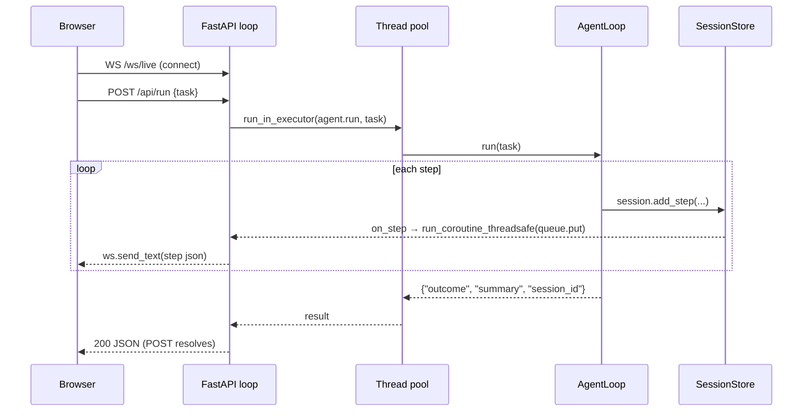

# 13 — APIs

Four public surfaces: the CLI, the dashboard HTTP/WS API, the MCP server tools, and the
programmatic Python API.

## 1. CLI (`swarn`, `agent/cli.py`)

Global options come **before** the subcommand: `--no-banner`, `-m/--model`,
`--max-iterations`, `--no-stream`, `--sandbox-tools` (run tools in a Docker sandbox instead
of the local filesystem), `-v/--version`.

Invoked with no subcommand, `swarn` opens the interactive REPL (§1.1). A bare prompt is
rewritten to `run` (`_rewrite_bare_prompt`), so `swarn "build me a model"` works.

| Command | Arguments / options | Exit code |
|---|---|---|
| `swarn run "<task>" [paths…]` | Optional document paths the task is about; `--ask` / `--agent` force the document fast path or the ReAct agent; `--page`, `--backend`, `--no-annotate`, `--json`, `--no-progress` | 0 iff outcome `complete`, else 1 |
| `swarn team "<task>"` | `--no-tester`, `--no-report`, `--no-progress` | 0 iff `complete`, else 1 |
| `swarn solve "<task>"` | `-d/--data DIR` (required unless `--resume`), `-s/--steps` (20), `-t/--time-limit`, `--drafts` (4), `-m/--model`, `--feedback-model`, `--exec-timeout` (600), `-w/--workers`, `--token-budget`, `--resume RUN_ID`, `--no-learn` | 0 iff a best node exists; 2 for missing data dir; else 1 |
| `swarn sessions` | `-n/--limit` (10) | 0 |
| `swarn recall <id-prefix>` | | 0 |
| `swarn index <path>` | | 0 |
| `swarn extract-pdf <pdf>` | `--mode document\|pages` (document), `--markdown/--md`, `--tables-only`, `--page`, `-o/--out`, `--csv-dir` | 0 |
| `swarn to-csv <pdf>` | `-o/--out` (one file), `-d/--dir`, `--page` (repeatable), `--split-fused`, `-q/--quiet` | 0 |
| `swarn doc-inspect [doc]` | `--page` (1), `--backend vlm\|text\|ocr\|mock`, `--all-pages`, `--no-annotate`, `-o/--out`, `-q/--quiet`. Omit the path to inspect a generated mock invoice | 0 |
| `swarn ingest [doc]` | `--backend text\|ocr`, `--render-pages`, `--force`, `--list` | 0 |
| `swarn ask "<question>" <doc>` | `--page`, `--backend`, `--no-annotate`, `--json` | 0 |
| `swarn playbook` | `--clear` | 0 |
| `swarn config` | `--path` (print the config file location and exit) | 0 |
| `swarn guardrail-benchmark` | | 0 |
| `swarn serve` | `-p/--port` (8420), `--host` (127.0.0.1) | blocks |
| `swarn mcp-serve` | | blocks (stdio) |

Also reachable without installation: `python -m agent.cli <command>`, or `python main.py`
(a shim that forwards argv unchanged).

### 1.1 REPL commands

There is **one** REPL implementation, in `agent/cli.py`. `main.py` used to carry a second,
hand-rolled one; the two drifted (commands existed in one and not the other, fixes to
either left the other stale) and it was collapsed into this shim.

| Command | Effect |
|---|---|
| `/help` | Command list |
| `/plan` | Render the current plan (`agent/core/plan.py`) |
| `/new` | Fresh conversation |
| `/compact` | Compact the context |
| `/undo` | Undo the last workspace change |
| `/model [name]`, `/effort [level]` | Show or set |
| `/status` | Session status |
| `/resume [id]` | Resume a past session |
| `/share-traces [on\|off]` | Toggle trace sharing |
| `/yolo` | Auto-approve — bypasses `approval_policy` and the cleaning approval gate |
| `history`, `recall <id>`, `index <path>`, `report`, `team <task>`, `guardrails` | Bare-word commands |
| `ask`, `ingest`, `inspect`, `to-csv`, `extract-pdf` | The document subcommands. Dispatched through `typer.main.get_command(app)` with `standalone_mode=False` — the *same* Click command the shell invokes, so every flag works here and the two surfaces cannot disagree. A non-zero exit or usage error is reported, not propagated: one bad command must not end the session. |

## 2. Dashboard HTTP/WS API (`agent/web/dashboard.py`)

No authentication. Binds 127.0.0.1 by default.

| Method & path | Request | Response |
|---|---|---|
| `GET /` | — | Embedded single-file HTML dashboard |
| `GET /api/sessions?limit=20` | — | `{"sessions": [index entries]}` — id, task[:80], model, outcome, duration_s, tool_calls, corrections, started_at |
| `GET /api/sessions/{id}` | id = UUID prefix (≥4 chars) | Full `trace.json` dict, or `{"error": …}` if not yet completed |
| `POST /api/run` | `{"task": str, "model": str?}` | **Blocks until the run finishes** (run executes in a thread-pool executor); returns `{"outcome", "summary", "session_id"}`. Live steps stream on the websocket meanwhile |
| `WS /ws/live` | client sends anything to keep-alive | JSON per step: `{session_id, task, kind, timestamp, data}` — only for runs in *this* process |
| `GET /api/runs?limit=50` | — | `{"runs":[{run_id, nodes, best_metric}]}` from `runs/*/journal.json` (corrupt journals tolerated) |
| `GET /api/runs/{run_id}` | — | `{run_id, journal: {...}, report_markdown: str}` |
| `GET /api/playbook` | — | `{"playbook": str}` |

The embedded page polls `/api/sessions` (5s) and `/api/runs` (7s), auto-reconnects the
websocket (2s), and posts to `/api/run` from a textarea.

## 3. MCP server tools (`agent/integrations/mcp_server.py`)

Exposed over stdio via FastMCP as server name `swarn`:

| Tool | Signature | Behavior |
|---|---|---|
| `swarn_submit_task` | `(task, data_dir="", steps=12, mode="auto", model="")` | mode auto→`solve` iff data_dir given else `agent`. Spawns a daemon thread; returns `task_id` immediately |
| `swarn_task_status` | `(task_id)` | `running|complete|failed`, elapsed, latest message, result when done |
| `swarn_get_messages` | `(task_id)` | Header + last 100 progress messages + result |
| `swarn_list_tasks` | `()` | One line per submitted task |

Progress messages: solve mode uses the `on_step` journal callback; agent mode captures the
loop's stdout via `redirect_stdout` and keeps the last 200 lines. Solve mode sets
`reflect=True`.

## 4. Programmatic Python API

```python
# ReAct agent
from agent.core.agent_loop import AgentLoop
from agent.core.self_correction import SelfCorrectionPolicy
from agent.observability.observability import GuardrailPolicy
result = AgentLoop(correction_policy=SelfCorrectionPolicy(),
                   guardrail_policy=GuardrailPolicy()).run("task")
# → {"outcome": "complete|no_tool_use|max_corrections|max_iterations",
#    "summary": str|None, "session_id": str}

# Tree search
from agent.search import SearchConfig, run_search
res = run_search("Predict y. Metric: AUC.", data_dir="data/",
                 config=SearchConfig(steps=25, time_limit_secs=3600),
                 evaluation_note="", on_step=None, resume_run_id=None)
# → SearchResult(run_id, run_dir, journal, best: Node|None, steps_done, wall_time)
#   res.solution_path, res.report_path

# Multi-agent
from agent.core.orchestrator import Orchestrator
out = Orchestrator().run("task")
# → {"final_outcome": str, "state": BlackboardState, "report_markdown": str}

# Tool registry (for embedding/hosting)
from agent.runtime.tools import get_tool_definitions, run_tool, TOOL_REGISTRY

# LLM layer
from agent.llm import create_client
resp = create_client().call(system, messages, tools=[...], tool_choice=None)
```

### Generated deployment API (per packaged model)

`workspace/deployments/<artifact_id>/app.py` exposes:
- `GET /health` → `{"status": "ok", "artifact_id": ...}`
- `POST /predict` — Pydantic model with one `float` field per (sanitized) training feature
  column → `{"<target>": float}`; 400 with detail on inference failure.
- Auto OpenAPI docs at `/docs`.

## API sequence — dashboard live run


