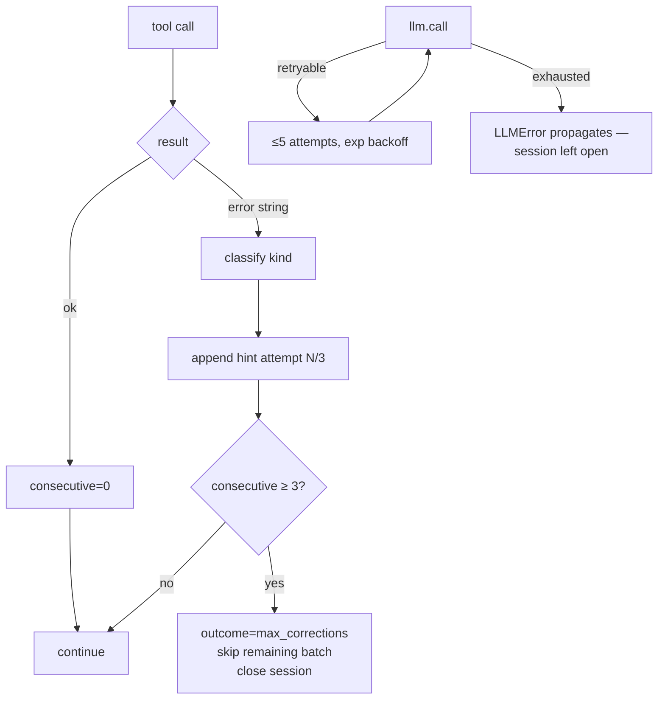

# 14 — Error Handling

## The core contract: "errors are strings"

Established in `tools.run_tool()` and repeated in every capability module's docstring:
tools **never raise**; failures return `"Error …"` strings that the model reads and reacts
to. This makes the LLM itself the retry mechanism ("the policy itself never retries
anything — retrying is Claude's job", `self_correction.py`).

Layered on top of that contract, in fixed order per tool call (`agent_loop.py`):

```
raw result
  └─ 1. SelfCorrectionPolicy.assess()      — detect, classify, hint, count, maybe abort
       └─ 2. GuardrailPolicy.scan()        — injection banner (see 16_Security)
            └─ 3. DoomLoopDetector.record()— repetition warning appended
```

## 1. Detection & classification (`self_correction.py`)

`_is_error(tool, result)` — precise signal matching to avoid false positives:
- `"Traceback (most recent call last)"` present
- `result.startswith("Error running '<tool>'")` (run_tool wrapper)
- `startswith("Error: ")` or `startswith("Error executing")`
- regex `\[exit(?:\s+code)?\s+[1-9]\d*\]` (sandbox non-zero exit)
- `"timed out after"` (case-insensitive)
- any of 24 Python exception names appearing as `Name:` or `Name\n`

`_classify(result) -> ErrorKind`: SYNTAX → IMPORT → FILE → TIMEOUT → RUNTIME → SHELL →
GENERIC (first match wins). Each kind has an instruction-phrased hint (`HINTS`), e.g.
IMPORT: "Call install_package('<name>') first, then retry."

Enrichment appended to the result:

```
━━ SELF-CORRECTION  [attempt N/3 • M remaining] ━━
Error type : <kind>
Guidance   : <hint>
```

Counters: `consecutive_errors` (reset by any success, or manually by the REPL between
tasks), `total_corrections`, `correction_log`. `should_abort()` at 3 consecutive → the
loop logs an ERROR step, sets outcome `max_corrections`, and stops **without executing the
rest of the current tool batch**.

## 2. LLM-call failures (`llm/base.py`)

- Up to 5 attempts; retry only when `str(e).lower()` contains one of
  `RETRYABLE_MARKERS = (overloaded, rate_limit, rate limit, 429, 500, 502, 503, 529,
  timeout, timed out, connection, temporarily)`.
- Backoff `min(2^attempt + random(), 30)` seconds, with a console notice.
- Exhaustion/non-retryable → `raise LLMError(...) from last_err`.

**Propagation differs by core:**
- `AgentLoop.run()` does **not** catch `LLMError` — it propagates to the entry point
  (REPL crashes the loop iteration; CLI exits with traceback; dashboard returns 500;
  the open Session is never closed/persisted). See Tech Debt.
- Search: `SearchAgent.review()` catches all review-call exceptions (node reviewed via the
  regex fallback); `propose()` does *not* catch — but in parallel mode a worker exception is
  caught by the runner (`fut.result()` try/except → "worker failed" log, node dropped);
  in sequential mode it propagates out of `run_search` (backend still closed via `finally`).
- Knowledge reflection: fully swallowed (`reflect_on_run` returns `[]`).

## 3. Execution failures (`execution.py`)

- Non-zero exit → `ExecResult(exit_code=N)`; `as_text()` prefixes `[exit N]` — which the
  correction policy recognizes as SHELL.
- Timeout → `timed_out=True`; subprocess preserves partial stdout/stderr from
  `TimeoutExpired`; Docker returns empty output and **recycles the container** so the
  runaway process actually dies.
- Docker exec exception → `ExecResult(output="Error executing in sandbox: …", exit_code=1)`.
- Output truncation (50k chars head+tail) prevents context blowups from chatty scripts.

## 4. Search-engine failure handling

| Failure | Handling |
|---|---|
| Model returns no code block | Node marked buggy: "Model produced no code block." (no execution) |
| Static gate rejection | Synthetic `StaticCheckError` term_out; buggy; zero exec cost; normal debug branch fixes it |
| Script crash / bad metric | Reviewer marks `is_bug`; `debug_prob` coin decides whether to debug the leaf (up to depth 3) |
| Timeout | `timed_out=True` → review short-circuits: "Execution timed out… Use a faster approach." |
| Review call fails | `analysis="(review call failed: …)"`; printed-metric regex fallback may still mark the node good (exit 0 + metric printed) |
| Worker thread dies | Logged, node lost, search continues |
| Budget exhausted | Clean stop; parallel mode drains in-flight nodes into the journal |
| Resume of missing run | `FileNotFoundError` raised to caller (CLI shows it) |
| Reflection/archive failure | Silent no-op |

## 5. Orchestrator failure handling

Any role ending with outcome ≠ `complete` or an empty summary short-circuits the pipeline
with `planner_failed` / `coder_failed` / `reviewer_failed` / `tester_failed`. Rejections
(NEEDS_CHANGES/FAIL) consume a shared revision budget (3) → `max_revisions_reached`.
There are no retries of a *failed* role — only verdict-driven Coder revisions.

## 6. Subsystem-specific postures

| Module | Posture |
|---|---|
| `data_pipeline` | Every loader/method returns `"Error: …"`; unknown dataset names list what *is* loaded |
| `feature_engineering`/`model_training` | Import errors → actionable "pip install …" strings; per-candidate failures become leaderboard rows ("FAILED — …") instead of failing the whole run |
| `evaluation`/`deployment` | Guard clauses for wrong task types, missing predict_proba, missing artifacts; ONNX export falls back to pickle with explanation |
| `context_engine` | `_ensure_ready()` catches *all* init errors (incl. HF download/network) and returns instructive strings — documented as a lesson learned |
| `mcp_integration` | Connect (30s), call (60s), disconnect (15s) timeouts → error strings; server task failure resolves the readiness future with the exception |
| `memory` | Subscriber callbacks exception-swallowed; corrupt index.json → start empty |
| `dashboard` | Corrupt journal tolerated in `/api/runs`; dead websockets pruned on send failure |
| `mcp_server` | Worker thread catches everything → status `failed` + error string result |

## 7. What is absent (verified)

- No circuit breakers; no retry queues; no exponential backoff outside the LLM client.
- No global exception handler in any entry point (REPL's `try` only guards `input()`).
- No timeout on the LLM call itself beyond SDK/socket defaults (retry markers include
  "timeout" but no explicit client-side deadline is configured).
- No validation of tool *inputs* beyond the JSON schema given to the model; a wrong-typed
  argument surfaces as a `TypeError` string via `run_tool`.

## Failure-path diagram (ReAct)


