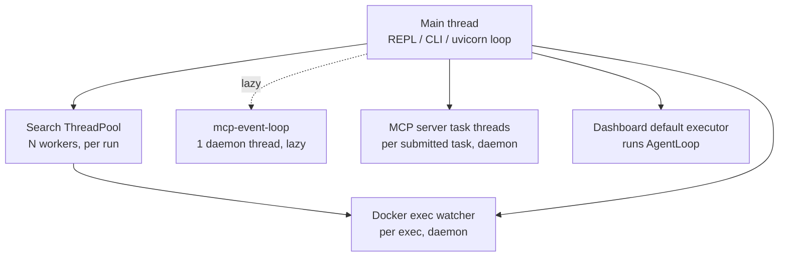

# 15 — Concurrency

The agent cores are synchronous. Concurrency exists in five well-bounded places.

## 1. Parallel tree search (`search/runner.py`)

- `ThreadPoolExecutor(max_workers=cfg.parallel_workers)`.
- **Shared mutable state:** the `Journal` and the `in_flight` map. One
  `threading.Lock` guards (a) action selection + reservation computation and (b)
  `journal.append` + `journal.save`. Proposal, gate, execution, and review run **outside**
  the lock (that's the parallelism).
- **Reservation-aware policy:** `choose_action(reserved=frozenset(parent_ids in flight),
  pending_drafts=count of in-flight drafts)` prevents two workers debugging the same leaf
  and prevents drafting past `num_drafts`. Verified by
  `test_parallel_resume.py::test_parallel_search_valid_journal` (dense unique steps, exactly
  `num_drafts` roots).
- **Budget exhaustion:** the scheduler stops launching, then *drains* in-flight futures
  into the journal before returning.
- **Thread-safety caveat:** each worker shares the same two cached LLM clients
  (`total_usage.add` is not locked — token counts can race benignly) and the same backend
  (Docker execs serialize on the container; subprocess execs run concurrently in the
  workspace with unique script names).

## 2. Docker exec watchdog (`execution.DockerBackend._run`)

Each exec runs `container.exec_run` in a daemon **watcher thread**; the caller
`join(timeout)`s it. On timeout the container is killed under `_lock`
(`_recycle_container`) — the abandoned thread's eventual result is discarded via the
`slot` dict. Rationale documented: Docker cannot kill an individual exec.

## 3. MCP client bridge (`mcp_integration.py`)

```
caller thread (sync)                     mcp-event-loop thread (asyncio, daemon)
────────────────────                     ───────────────────────────────────────
connect_server ──run_coroutine_threadsafe──▶ _server_task_main  (ONE task per server)
call_mcp_tool  ──_run_coro(_submit_call)───▶   queue.get() → session.call_tool → future.set_result
disconnect     ──queue.put(None)───────────▶   finally: exit_stack.aclose()  (same task)
```

- One persistent event loop in a named daemon thread (`mcp-event-loop`), started
  idempotently under `_lock` with a `threading.Event` readiness handshake.
- **Why one owner task per server:** anyio (under the MCP SDK) binds a context manager's
  cancel scope to the task that entered it; a context opened in one coroutine cannot be
  closed from another, even on the same loop. Hence all calls and the disconnect are routed
  through the owner task's queue. This is documented as "required, not a style choice".
- Sync callers block on `concurrent.futures.Future.result(timeout)`.

## 4. Dashboard sync→async bridge (`dashboard.py`)

- `POST /api/run` offloads the blocking `AgentLoop.run` to
  `loop.run_in_executor(None, ...)` so the event loop (and the websocket broadcast task)
  stays responsive.
- Step delivery: the store subscriber `on_step` runs on the **agent's executor thread**; it
  enqueues via `asyncio.run_coroutine_threadsafe(queue.put(payload), loop)`; the async
  `broadcast_loop` task drains the queue and fans out to websockets, pruning dead ones.
  Mirror-image of the MCP bridge (sync producer → async consumer), and noted as such in the
  module docstring.

## 5. MCP server task threads (`mcp_server.py`)

One daemon `threading.Thread` per submitted task; results written into the shared
`_TASKS[rec.id]` record (insert under `_LOCK`; subsequent mutation single-writer by the
worker thread; readers are the MCP tool handlers). Agent-mode output capture uses
`redirect_stdout` — note this swaps `sys.stdout` **process-wide**, so concurrent tasks'
output can interleave into the wrong transcript (see Tech Debt).

## Locks inventory

| Lock | Guards |
|---|---|
| `runner.run_search.lock` | journal append/save + action selection |
| `DockerBackend._lock` | container create / recycle |
| `MCPManager._lock` | loop startup + `_servers` map |
| `mcp_server._LOCK` | `_TASKS` insertion |
| *(none)* | singleton initializers, `TOOL_REGISTRY` mutation, `Usage` accumulation, `SessionStore` |

## Things that look async but aren't

- `AgentLoop`, `Orchestrator`, all tools, all LLM calls: fully synchronous/blocking.
- `Session.add_step` callbacks: synchronous, on the caller's thread.
- The dashboard's "Returns immediately" is explicitly **not** true for `POST /api/run` —
  it blocks until the run finishes (documented in the endpoint docstring); liveness comes
  from the websocket.

## Background threads at a glance


