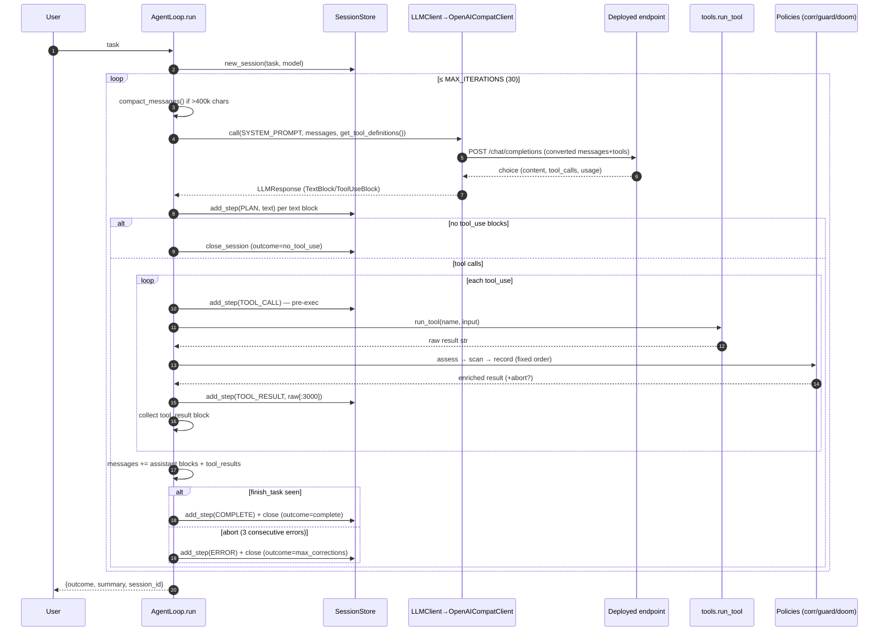
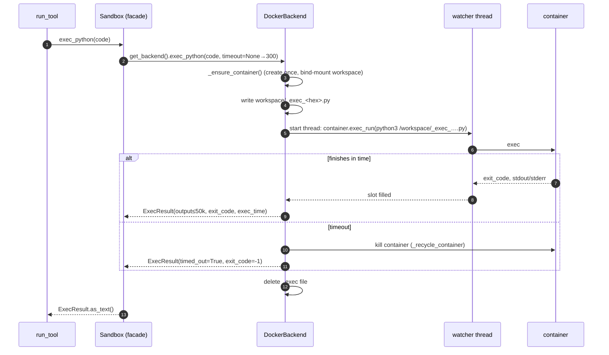
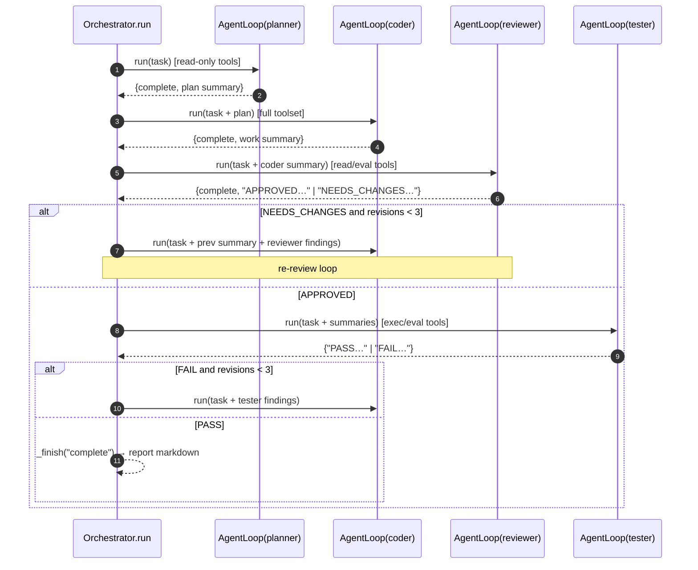
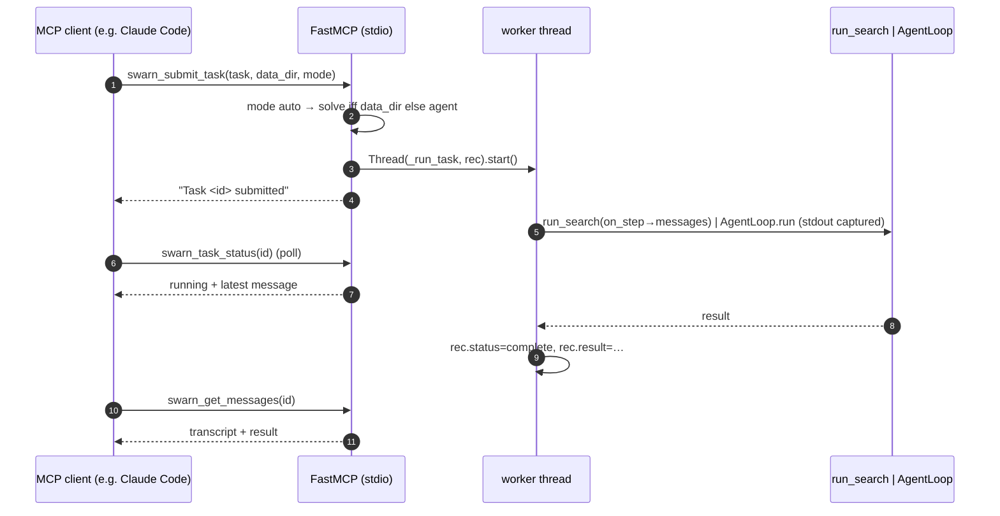

# 18 — Sequence Diagrams

## 1. Single-agent task (REPL / `swarn run`)



## 2. `run_python` tool with Docker sandbox



## 3. Tree search — one parallel run (`swarn solve -w N`)

```mermaid
sequenceDiagram
    autonumber
    participant CLI as cli.solve
    participant RS as run_search
    participant KS as KnowledgeStore
    participant SA as SearchAgent
    participant TP as ThreadPool worker
    participant BE as backend (per-run)
    participant J as Journal

    CLI->>RS: task, data_dir, SearchConfig
    RS->>RS: _prepare_run → runs/<id>/workspace/input (copy data)
    RS->>BE: make_backend(workspace)
    RS->>RS: data_preview.generate(input/)
    RS->>KS: context_for_task(task) → playbook + similar runs
    RS->>SA: SearchAgent(task, cfg, journal, preview, knowledge)
    loop until steps/budget done
        RS->>SA: (lock) choose_action(reserved, pending_drafts)
        RS->>TP: submit _work_one(stage, parent)
        TP->>SA: propose → code LLM call → Node
        TP->>TP: static_check(code) — maybe short-circuit buggy
        TP->>BE: exec_python(code, budget.node_timeout())
        TP->>SA: review(node) — forced submit_review + metric regex
        TP-->>RS: node
        RS->>J: (lock) append + save journal.json
        RS->>RS: on_step callback, log line
    end
    RS->>BE: close() (finally)
    RS->>J: write best_solution.py + final save
    RS->>RS: write_report(report.md)
    RS->>KS: index_run(...); reflect_on_run → add_lessons (if reflect)
    RS-->>CLI: SearchResult
```

## 4. Team pipeline (`swarn team` / REPL `team`)



## 5. `connect_mcp_server` and first remote tool call

```mermaid
sequenceDiagram
    autonumber
    participant LLM as Model
    participant AL as AgentLoop
    participant MM as MCPManager (sync side)
    participant EL as mcp-event-loop thread
    participant OT as owner task (_server_task_main)
    participant SRV as MCP server subprocess

    LLM-->>AL: tool_use connect_mcp_server{name, command, args}
    AL->>MM: connect_server(...)
    MM->>EL: ensure loop thread; create queue + ready future
    MM->>EL: schedule _server_task_main
    EL->>OT: run task
    OT->>SRV: spawn subprocess (stdio) + ClientSession.initialize()
    OT->>SRV: list_tools()
    OT->>OT: TOOL_REGISTRY["mcp_<srv>_<tool>"] = closure per tool
    OT-->>MM: ready future → (tool_names, command)
    MM-->>AL: "Connected… Registered N tool(s)" (string)
    Note over AL: next iteration: get_tool_definitions() now includes mcp_* tools
    LLM-->>AL: tool_use mcp_<srv>_<tool>{...}
    AL->>MM: closure → call_mcp_tool(server, tool, kwargs)
    MM->>EL: _submit_call → queue.put((tool, args, future))
    OT->>SRV: session.call_tool(tool, args)
    SRV-->>OT: content blocks
    OT-->>MM: future.set_result(_extract_text(...))
    MM-->>AL: result string (≤60s or timeout error string)
```

## 6. Dashboard live run

See [13_APIs.md](13_APIs.md) — browser connects `/ws/live`, POSTs `/api/run`; the run
executes in the executor thread of the same process; each `Session.add_step` crosses into
the event loop via `run_coroutine_threadsafe`; `broadcast_loop` fans out to sockets; the
POST resolves with the final outcome.

## 7. MCP-server task submission (external client driving Swarn)



## 8. Startup flows

Covered in [03_Startup_Sequence.md](03_Startup_Sequence.md) (REPL diagram included there).
