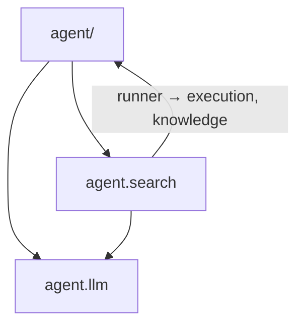
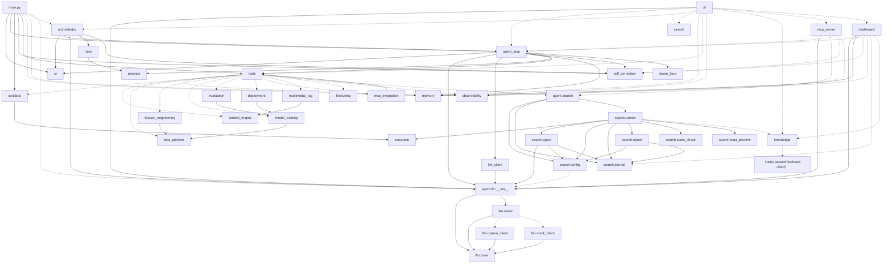

# 19 — Dependency Graph

## Package-level

`agent.llm` depends on nothing else in the project (leaf package).
`agent.search` depends on `agent.llm`, `agent.execution`, and (lazily) `agent.knowledge`.

## Module import graph (static imports; dashed = lazy/function-level import)

## The one import cycle, and how it's broken

`tools.py ⇄ mcp_integration.py`:
- `mcp_integration.py` imports `TOOL_REGISTRY` from `tools.py` **at module top** (needs to
  write into it).
- `tools.py` imports `mcp_integration` **lazily inside the four MCP tool bodies**.

Because `tools.py` only imports `mcp_integration` at call time, the cycle never bites at
import. Similarly, `search/config.py` gets `DEFAULT_MODEL` through a lazy `_default_model()`
function explicitly commented "lazy import avoids cycles at module load".

## Lazy-import policy (systemic)

Function-level imports are used everywhere for three documented reasons:
1. **Startup speed / optional deps** — heavy libs (torch, chromadb, transformers, whisper,
   docker, matplotlib, optuna) load only when their tool runs; missing ones become error
   strings, not crashes.
2. **Cycle avoidance** — tools ↔ mcp_integration, search.config ↔ llm.
3. **CLI hygiene** — `swarn --help` shouldn't construct clients (`cli.py` comment).

## Third-party dependency layers

| Layer | Direct deps |
|---|---|
| Always needed | python-dotenv, openai, rich, typer |
| ReAct extras | (none additional — file tools are stdlib) |
| RAG | sentence-transformers, chromadb; pdfplumber, pytesseract, pillow (multimodal); openai-whisper (on demand) |
| ML pipeline | pandas, numpy, scikit-learn, xgboost, lightgbm, torch, optuna, matplotlib, joblib, openpyxl, pyarrow, sqlalchemy, pandera |
| Fine-tuning | peft, datasets, accelerate (+bitsandbytes on demand) |
| MCP | mcp |
| Observability | opentelemetry-api/sdk (+otlp exporter on demand) |
| Dashboard | fastapi, uvicorn, websockets |
| Sandbox | docker (commented out — install to enable) |

## Fan-in / fan-out hotspots

- **Highest fan-in:** `agent/llm` (imported by loop, shim, search, router consumers,
  cli, dashboard, mcp_server, orchestrator) and `tools.py` (loop, roles via names,
  mcp_integration, main, cli).
- **Highest fan-out:** `tools.py` (lazily touches 12 subsystems) and `cli.py` (touches
  everything by design).
- **Leaf utilities:** `ui.py` (imports only rich + stdlib), `doom_loop.py`,
  `static_check.py`, `data_preview.py`, `prompts.py`.

## Layering violations observed

- `evaluation.compare_models` reads `trainer._trained_models` directly (private attribute,
  self-acknowledged "read-only access, same module family").
- `multimodal_rag` reaches into `ContextEngine._collection/_embedder/_ensure_ready` and
  attaches `_clip_embedder` onto the engine instance (documented as deliberate reuse).
- `dashboard` reads `store._index` directly.
These are the only cross-module private accesses found; each is commented in code.
